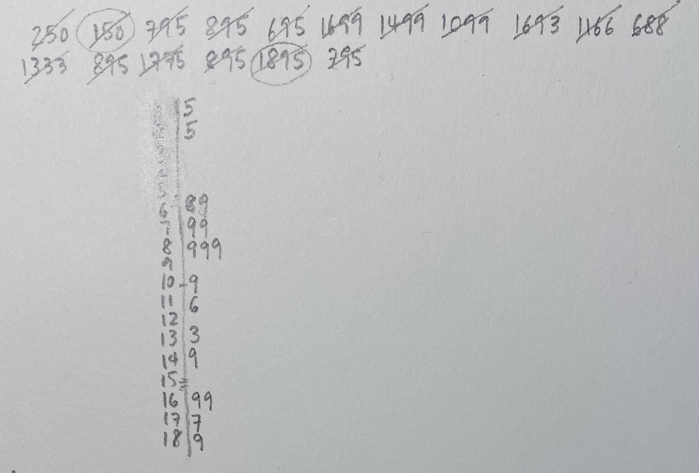
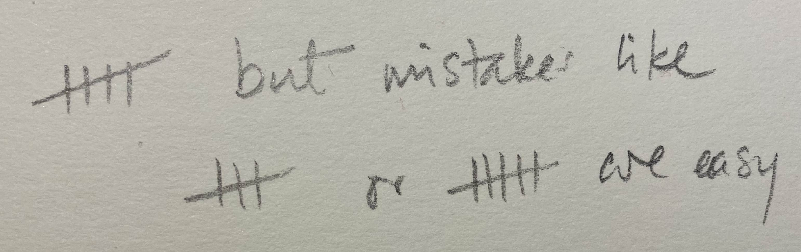
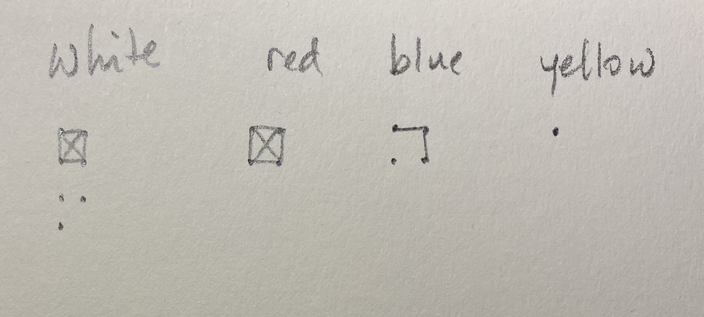
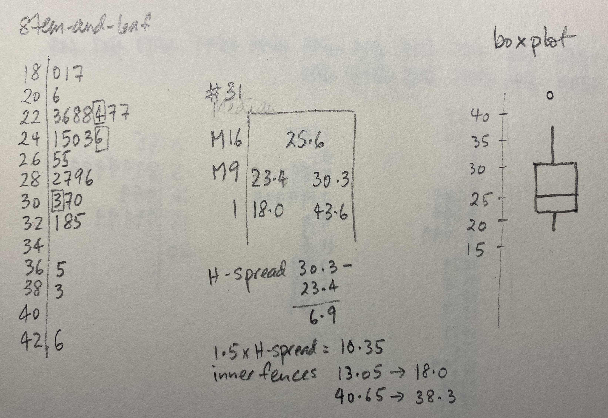

```{r include=FALSE}
# automatically create a bib database for R packages
knitr::opts_chunk$set(
  echo = FALSE,
  warning = FALSE,
  message = FALSE,
  cache = FALSE,
  fig.width = 6,
  fig.height = 4,
  fig.align = "center",
  out.width = "90%",
  fig.retina = 3
)
```

# What is exploratory data analysis? {#what-is-eda}

Exploratory data analysis is a term that became popular after John Tukey published his seminal book on the topic in 1977 [@tukey77]. What is actually refers to, though, is not very well-defined. 


## Common descriptions
<!-- Some common explanations -->
EDA today is prevalent, and there are many descriptions. It's interesting to compare and contrast these, in relation to the original scope. 

From [wikipedia](https://en.wikipedia.org/wiki/Exploratory_data_analysis)

> In statistics, exploratory data analysis (EDA) is an approach to analyzing data sets to summarize their main characteristics, often with visual methods. A statistical model can be used or not, but primarily EDA is for seeing what the data can tell us beyond the formal modeling or hypothesis testing task. 

In @r4ds

> EDA is not a formal process with a strict set of rules. More than anything, EDA is a state of mind. During the initial phases of EDA you should feel free to investigate every idea that occurs to you. Some of these ideas will pan out, and some will be dead ends.

The [National Institute of Standards and Technology](https://www.itl.nist.gov/div898/handbook/eda/section1/eda11.htm)

> Exploratory Data Analysis (EDA) is an approach/philosophy for data analysis that employs a variety of techniques (mostly graphical) to (1) maximize insight into a data set; (2) uncover underlying structure; (3) extract important variables; (4) detect outliers and anomalies; (5) test underlying assumptions; (6) develop parsimonious models; and (7) determine optimal factor settings.

The predictive analytics competition site [Kaggle](https://www.kaggle.com/pavansanagapati/a-simple-tutorial-on-exploratory-data-analysis) says

> What is Exploratory Data Analysis (EDA)? (1) How to ensure you are ready to use machine learning algorithms in a project? (2) How to choose the most suitable algorithms for your data set? (3) How to define the feature variables that can potentially be used for machine learning?

Legacy data analysis software system [SAS](https://seleritysas.com/blog/2020/05/08/exploratory-data-analysis-and-its-role-in-improving-business-operations/) says

> EDA is necessary for the next stage of data research. If there was an analogy to exploratory data analysis, it would be that of a painter examining their tools and available time, before deciding on what best to paint.

The massive online [John Hopkins EDA class](https://www.coursera.org/learn/exploratory-data-analysis#syllabus) describes it as

> These techniques are typically applied before formal modeling commences and can help inform the development of more complex statistical models. Exploratory techniques are also important for eliminating or sharpening potential hypotheses about the world that can be addressed by the data.

General information site [Towards Data Science](https://towardsdatascience.com/if-you-dont-find-anything-new-you-don-t-do-eda-right-d356f9995098) says

> The purpose of doing the Exploratory Data Analysis or EDA is to find new information in data. The understanding of EDA that practitioners may not aware of, is the EDA uses a visually-examined dataset to understand and summarize the main characteristics of the dataset without having a prior hypothesis or relying upon statistical models.

## Components of data analysis

Data analysis is a process of cleaning, transforming,
inspecting and modelling data with the aim of extracting
information. It might be exploratory or confirmatory, descriptive of predictive.

<!-- Modeling and prediction -->
Before modelling and predicting, data should first be explored to uncover the patterns and structures that exist. Data analysis involves both numerical and visual techniques designed to reveal interesting information that may be hidden in the data. However, an analyst must be cautious not to over-interpret apparent patterns, and to make efforts assess the results of an analysis are reliable for the data being studied and potentially for new data.

<!-- Inference -->
In a confirmatory data analysis (CDA), the focus is on answering a particular question, and includes processes such as testing hypothesis, model selection, or predictive modelling for the purposes of statistical inference. An important part of this is to check the sometimes strict assumptions made in order to conduct inference, and that problems in the data don't compromise the inference. This is usually called *initial data analysis*. In addition, computing *model diagnostics*, like making residual plots, is an important part of checking that a predictive model appropriately fits the data. 

## Differentiating EDA from CDA

### From the case study

*Back-story*: In 1995 I (Di), as a newly fledged assistant professor, was asked to teach a Business Statistics course. In the process of looking for appropriate examples, I found a book titled "Practical Data Analysis: Case Studies in Business Statistics" by Bryant and Smith [@bryantsmith1995]. The example on tipping in restaurants caught my eye, because I had always found tipping to be a difficult. Perhaps this was because I was an Australian new to the practice after moving to the USA for graduate school, in 1988 and still uncomfortable with the culture almost a decade later. The types of questions that bounce around mentally, should I tip because the wait staff's wage comes mostly from this money, how much does the restaurant owner take from the worker, was the service good, have I just been paid and can be generous. 

#### What is tipping? {-#whatistipping}

According to [The basic rules of tipping that everyone should know about](https://www.washingtonpost.com/news/going-out-guide/wp/2016/09/15/tipping-can-be-complicated-these-are-the-basic-rules-you-should-know-about/):

- When you're dining at a full-service restaurant
    - Tip 20 percent of your full bill.
- When you grab a cup of coffee
    - Round up or add a dollar if you're a regular or ordered a complicated drink.
- When you have lunch at a food truck
    - Drop a few dollars into the tip jar, but a little less than you would at a dine-in spot.
- When you use a gift card
    - Tip on the total value of the meal, not just what you paid out of pocket.

#### About the data {-#aboutthedata}

The tips case study data is described as follows:

> In one restaurant, a food server recorded the following data on all customers they served during an interval of two and a half months in early 1990.

> Food servers’ tips in restaurants may be influenced by many factors, including the nature of the restaurant, size of the party, and table locations in the restaurant. Restaurant managers need to know which factors matter when they assign tables to food servers.

and a description of the variables is as reported in @cookswayne07:


#### Case study procedure (which would be considered to be CDA) {-#casestudyprocedure}

To answer the question "What are the most important factors affecting tips?", the analysis should follow these steps according to @bryantsmith1995:

1. Develop a model
    - Should the response be `tip` alone and use the total bill as a predictor?
    - Should you create a new variable `tip rate` and use this as the response?
2.  Fit the full model with sex, smoker, day, time and size as predictors
3.  Refine model: Should some variables should be dropped?
4. Check distribution of residuals
5. Summarise the model, if X=something, what would be the expected tip

#### Step 1 {-#step1}

Calculate tip % as tip/total bill $\times$ 100

```{r echo = TRUE}
library(tidyverse)
tips <- read_csv("http://ggobi.org/book/data/tips.csv")
```

```{r echo = TRUE}
tips <- tips %>%
  mutate(tip_pct = tip/totbill * 100) #<<
```

#### Step 2 {-#step2}

Fit the full model with all variables

```{r echo = TRUE}
tips_lm <- tips %>%
  select(tip_pct, sex, smoker, day, time, size) %>%
  lm(tip_pct ~ ., data=.) #<<
```

Summarise the model

```{r modela, echo=TRUE}
library(broom)
library(kableExtra)
tidy(tips_lm) %>% #<<
  kable(digits=2) %>% 
  kable_styling() 
```

```{r modelb, echo=TRUE}
glance(tips_lm) %>% #<<
  select(r.squared, statistic, p.value) %>% 
  kable(digits=3)
```

From the model summary the most (and only) important variable for predicting tip is the size of the dining party. This decision is based on the $t$-statistic and $p$-values reported in the model summary. Size of the party is the only variable which has a really small $p$-value. The small value indicates that it is very unlikely for the true parameter relating size of the party to tip % to be 0, that is, the relationship between these two variables is considered to be statistically significant. The same cannot be said for any of the other variables. 

#### Step 3 {-#step3}

Refine the model, by using only one predictor, size of the dining party.

```{r model_smalla, echo=TRUE}
tips_lm <- tips %>%
  select(tip_pct, size) %>% #<<
  lm(tip_pct ~ ., data=.) 
tidy(tips_lm) %>% #<<
  kable(digits=2) %>% 
  kable_styling() 
```

$$\widehat{tip %} = 18.44 - 0.92 \times size$$

As the size of the dining party increases by one person the tip decreases by approximately 1%.

```{r model_smallb, echo=TRUE}
glance(tips_lm) %>% #<<
  select(r.squared, statistic, p.value) %>% 
  rename(`F statistic` = statistic) %>%
  kable(digits=3)
```

$R^2 = 0.02$.

This dropped by half from the full model, even though no other variables contributed significantly to the model. It might be possible to bring the $R^2$ up a little by adding interaction terms to the model, for example, sex, or smoker, and size of the party. We won't don that here, because the purpose is to illustrate the difference between exploratory and confirmatory rather than fitting the best possible model.

**What do the $F$ statistic and $p$-value mean?**

Assume that we have a random sample from a population. Assume that the model for the population is 

$$ \widehat{tip %} = \beta_0 + \beta_1 sexM + ... + \beta_7 size $$
and we have observed

$$ \widehat{tip %} = b_0 + b_1  sexM + ... + b_7 size $$
The $F$ statistic refers to 

$$ H_o: \beta_1 = ... = \beta_7 = 0 ~~ vs ~~ H_a: \text{at least one is not 0}$$
The $p$-value is the probability that we observe the given $F$ value or larger, computed assuming $H_o$ is true.

**What do the $t$ statistics and $p$-value associated with model coeficients mean?**

Assume that we have a random sample from a population. Assume that the model for the population is 

$$ \widehat{tip %} = \beta_0 + \beta_1 sexM + ... + \beta_7 size $$
and we have observed

$$ \widehat{tip %} = b_0 + b_1  sexM + ... + b_7 size $$

The $t$ statistics in the coefficient summary refer to 

$$ H_o: \beta_k = 0 ~~ vs ~~ H_a: \beta_k \neq 0 $$
The $p$-value is the probability that we observe the given $t$ value or more extreme, computed assuming $H_o$ is true.

#### Model checking {-#modelchecking}

Normally, the final model summary would be accompanied diagnostic plots

- observed vs fitted values to check strength and appropriateness of the fit
- univariate plot, and normal probability plot, of residuals to check for normality
- in the simple final model like this, the observed vs predictor, with model overlaid would be advised to assess the model relative to the variability around the model
- when the final model has more terms, using a partial dependence plot to check the relative relationship between the response and predictors would be recommended.

```{r res_hist, echo=TRUE}
tips_aug <- augment(tips_lm)
ggplot(tips_aug, 
    aes(x=.resid)) + #<<
  geom_histogram() +
  xlab("residuals") 
```

```{r res_qq, echo=TRUE}
ggplot(tips_aug, 
    aes(sample=.resid)) + #<<
  stat_qq() +
  stat_qq_line() +
  xlab("residuals") +
  theme(aspect.ratio=1)
```

```{r obs_fitted, echo=TRUE}
ggplot(tips_aug, 
    aes(x=.fitted, y=tip_pct)) + #<<
  geom_point() +
  geom_smooth(method="lm") +
  xlab("observed") +
  ylab("fitted")
```

```{r fitted_model, echo=TRUE}
ggplot(tips_aug, 
    aes(x=size, y=tip_pct)) + #<<
  geom_point() +
  geom_smooth(method="lm") +
  ylab("tip %")
```

The result of this work would leave us with a model that could be used to impose a dining/tipping policy in restaurants (see [here](https://travel.stackexchange.com/questions/40543/can-i-refuse-to-pay-auto-gratuity-in-a-restaurant)) and should also leave us with an unease that this policy is based on weak support.

#### Summarise the model, and answer the question

The answer to the original question is that the only important factor affecting tip is the size of the dining party.

The final model is

$$\widehat{tip %} = 18.44 - 0.92 \times size$$

The interpretation of the model is, *as the size of the dining party increases by one person the tip decreases by approximately 1%*.

**What does $R^2 = 0.02$ mean?**

$R^2 = 0.02$ means that size explains just 2% of the variance in tip %. This is a very weak model. 

And $R^2 = 0.04$ is also a very weak model.

#### Overview of CDA process

In this example, the analysis has basically followed the CDA process outlined in Figure \@ref(fig:cda). It started from a specific and clearly defined question, skipped the IDA, to go straight into modeling, followed by diagnostics, which should have been finished with a statement of conclusion.

```{r cda, fig.cap="Pipeline of confirmatory data analysis. It starts with a question."}
library(DiagrammeR)
cda_nodes <- create_node_df(n=6, 
               type=c("action", "action",
                      "action", "action",
                      "action", "action"),
               label = c("question/hypothesis",
                          "data", "IDA",
                          "model/test", "MD",
                          "conclusion"),
               shape = c("rectangle", "rectangle",
                         "rectangle", "rectangle",
                         "rectangle", "rectangle"),
               width = c(3.2, 1, 1, 1.8, 1, 2.1),
               fillcolor = c("grey90", "grey90",
                             "grey90", "grey90",
                             "grey90", "grey90"),
               fontsize = c(24, 24, 24, 24, 24, 24)
               )
cda_edges <- create_edge_df(from = 1:5, to = 2:6, 
                            color = "black")
cda <- create_graph(cda_nodes, cda_edges, 
                    directed = TRUE, 
                    attr_theme = "tb")
render_graph(cda)
```

### EDA approach

First, examine the data description, and the explanation of the variables. In the tips example, this would be:

- tip and totbill are quantitative, but generally we would think about tip as a percentage of the bill, so creating this new variable would be useful, too.
- sex, smoker, day, time of day are categorical.
- size is discrete/integer.

The types of variables suggest what summaries to make. 

For the quantitative variables we would calculate 

- means, standard deviations, median, quartiles, minimum and maximum, and 
- also make histograms or density plots and scatterplots to explore bivariate relationships.

For categorical variables, and integer variables with few categories, compute 

- counts and proportions, and
- make bar charts and mosaic plots

Thinking about relationships between categorical and quantitative variables, we could 
- calculate the numerical summaries by the categorical variable levels, and 
- make histograms and scatterplots, facetted by the categorical variables.

#### Look at the distribution of tips, total bill. {-#tip}

```{r tips, echo=TRUE}
ggplot(tips, 
    aes(x=tip)) + #<<
  geom_histogram(
    colour="white")  
```

Because, one binwidth is never enough ...

```{r tips2, echo=TRUE}
ggplot(tips, 
    aes(x=tip)) +
  geom_histogram(
    breaks=seq(0.5,10.5,1), #<< 
    colour="white") + 
  scale_x_continuous(
    breaks=seq(0,11,1))
```

Big fat bins. Tips are skewed, which means most tips are relatively small.

```{r tips3, echo=TRUE}
ggplot(tips, 
    aes(x=tip)) + 
  geom_histogram(
    breaks=seq(0.5,10.5,0.1), #<<
    colour="white") +
  scale_x_continuous(
    breaks=seq(0,11,1))
```

Skinny bins. Tips are multimodal, and occurring at the full dollar and 50c amounts.

#### Relationship between tip and total {-#tiptotal}

```{r tips_tot, echo=TRUE}
p <- ggplot(tips, 
    aes(x=totbill, y=tip)) + 
  geom_point() + #<<
  scale_y_continuous(
    breaks=seq(0,11,1))
p
```

Adding a regression line, helps to focus on a tipping standard, and whether individual tips are above or below expected.

```{r tips_tot2, echo=TRUE}
p <- p + geom_abline(intercept=0, #<<
              slope=0.2) + #<<
  annotate("text", x=45, y=10, 
           label="20% tip") 
p
```

Most tips less than 20%, there are more "skin flints" than generous diners. There are a couple of big tips, and we can see the banding horizontally that is the rounding seen from the histogram of tips.


#### Examine the distributions across categorical variables. {-#tipcategorical}

```{r tips_sexsmoke, echo=TRUE}
p + facet_grid(smoker~sex) #<<
```

- The bigger bills tend to be paid by men (and females that smoke).
- Except for three diners, female non-smokers are very consistent tippers, probably around 15-18% though.
- The variability in the smokers is much higher than for the non-smokers.

**Isn't this interesting?**

#### Overview of EDA process

The process of EDA here roughly follows the outline provided in Figure \@ref(fig:eda). We looked at what variables were available, and thought of the different ways we might look at them, implicitly determining a question relevant for each. Once we made each plot, we thought about what was the pattern, what it suggested, and whether this was surprising. 

```{r eda, fig.cap="Pipeline of exploratory data analysis. It starts with the data."}
eda_nodes <- create_node_df(n=6, 
               type=c("action", "action",
                      "action", "action",
                      "action", "action"),
               label = c("data", "what variables are available",
                         "lots of open questions", 
                         "what might you expect to see",
                         "plot or calculate", 
                         "is this what you expected?"),
               shape = c("rectangle", "rectangle",
                         "rectangle", "rectangle",
                         "rectangle", "rectangle"),
               width = c(1, 5, 4, 5, 3, 4),
               fillcolor = c("grey90", "grey90",
                             "grey90", "grey90",
                             "grey90", "grey90"),
               fontsize = c(24, 24, 24, 24, 24, 24)
               )
eda_edges <- create_edge_df(from = 1:5, to = 2:6, 
                            color = "black")
eda <- create_graph(eda_nodes, eda_edges, 
                    directed = TRUE, 
                    attr_theme = "tb")
render_graph(eda)
```

### What we learned from EDA

In the above example we gained a wealth of insight in a short time. Using nothing but graphical methods we investigated univariate, bivariate, and multivariate relationships. We found both global features and local detail. We saw that tips were rounded; then we saw the obvious correlation between the tip and the size of the bill, noting the scarcity of generous tippers; finally we discovered differences in the tipping behavior of male and female smokers and non-smokers.

Notice that we used very simple plots to explore some pretty complex relationships involving as many as four variables. Each plot shows a subset obtained by partitioning the data according to two binary variables. The statistical term for partitioning based on variables is “conditioning.” For example, the top left plot shows the dining parties that meet the condition that the bill payer was a male non-smoker: sex = male and smoking = False. In database terminology this plot would be called the result of "drill-down". The idea of conditioning is richer than drill-down because it involves a structured partitioning of all data as opposed to the extraction of a single partition.

Having generated the four plots, we arrange them in a two-by-two layout to reflect the two variables on which we conditioned. Although the axes in each plot are tip and bill, the axes of the overall figure are smoking (vertical) and sex (horizontal). The arrangement permits us to make several kinds of comparisons and to make observations about the partitions.

### Reality check

The preceding explanations may have given a somewhat misleading impression of the process of data analysis. In our account the data had no problems; for example, there were no missing values and no recording errors. Every step was logical and necessary. Every question we asked had a meaningful answer. Every plot that was produced was useful and informative. In actual data analysis, nothing could be further from the truth. Real datasets are rarely perfect; most choices are guided by intuition, knowledge, and judgment; most steps lead to dead ends; most plots end up in the wastebasket. This may sound daunting, but even though data analysis is a highly improvisational activity, it can be given some structure nonetheless.

### What is EDA?

In this stage in the analysis, we make time to "play in the sand" to allow us to find the unexpected, and come to some understanding of our data. We like to think of this as a little like traveling. We may have a purpose in visiting a new city, perhaps to attend a conference, but we need to take care of our basic necessities, such as finding eating places and gas stations. Some of our movements will be pre-determined, or guided by the advice of others, but some of the time we wander around by ourselves. We may find a cafe we particularly like or a cheaper gas station. This is all about getting to know the neighborhood.

EDA has always depended heavily on graphics, even before the term data visualization was coined. Our favorite quote from John Tukey’s rich legacy is that we need good pictures to *"force the unexpected upon us."*


### Isn't it data snooping?

- Because EDA is very graphical, it sometimes gives rise to a suspicion that patterns in the data are being detected and reported that are not really there. 
- So many different combinations may be examined, that something is bound to be interesting. 
- `r emo::ji("danger")` Structure seen in the plot drives hypothesis testing (on same data).

*Sometimes this is called data snooping.*

We snooped into the tips data, and from a few plots we learned an enormous amount of information about tipping: There is a scarcity of generous tippers, the variability in tips increases extraordinarily for smoking parties, and people tend to round their tips. These are very different types of tipping behaviors than what we learned from the regression model. The regression model was not compromised by what we learned from graphics, and indeed, *we have a richer and more informative analysis. Making plots of the data is just smart.*

**False discovery is the lesser danger when compared to non-discovery. Non-discovery is the failure to identify meaningful structure, and it may result in false or incomplete modeling. In a healthy scientific enterprise, the fear of non-discovery should be at least as great as the fear of false discovery.**

### Why aren't there more resources on EDA?

> Teaching data analysis is not easy, and the time allowed is always far from sufficient. But these difficulties have been enhanced by the view that "avoidance of cookbookery and growth of understanding come only by mathematical treatment, with emphasis upon proofs." The problem of cookbookery is not peculiar to data analysis. But the solution of concentrating upon mathematics and proof is. @tukey1962 

There are many courses now, every introductory statistics course begins with exploratory data analysis, and teaches box plots. It is just a simple treatment, though. A book by [Peng](https://bookdown.org/rdpeng/exdata/), and a [Coursera class by Peng, Leek and Caffo](https://www.coursera.org/learn/exploratory-data-analysis) with more than a 100,000 regularly enrolled. 

<center> <ADD SOFTWARE TOO> </center>

**But we argue that there is something missing from all of this. Almost all of these resources focus on what would be called initial data analysis. These don't capture the spirit of EDA, as introduced by Tukey.**

## The origins of EDA

The field of exploratory data analysis came of age with the appearance of Exploratory Data Analysis [@tukey77]. 

<center></center>

*Tukey held that too much emphasis in statistics was placed on statistical hypothesis testing (confirmatory data analysis); more emphasis needed to be placed on using data to suggest hypotheses to test.*

::: do

Take a glimpse back in time is possible with the [American Statistical Association video lending library](http://stat-graphics.org/movies/). 

Watch [John Tukey talking about exploring high-dimensional data with an amazing new computer in 1973](https://www.youtube.com/embed/B7XoW2qiFUA), four years before the EDA book. Look out for these things:

- Tukey's expertise is described as *for trial and error learning* and 
- the computing equipment, especially how the human interacted with the screen,
- and the hair style of Jerry Friedman.

The first 4.25 minutes are the best!
:::

The orange book was written NOT to convince readers of the usefulness of EDA, NOT to provide a set of case studies, but to provide a huge number of individual and isolated techniques that data analysts might find useful in their work. In this sense the book contains a wealth of data analysis wisdom, which also make it a bit impenetrable, and perhaps best read is small increments. When you do that you'll find an amazing collection of creative ways to "scratch down numbers" peppered with snippets of wisdom for working with data. Here are a few of our favourite snippets from the text, revealing words of wisdom. 

- **It is important to understand  what you CAN DO before you learn to measure how WELL you seem to have DONE it.** Learning first what you can do will help you to work more easily and effectively. 
- A basic problem about any body of data is to make it **more easily and effectively handleable by minds -- our minds, her mind, his mind**. To this general end:
    - anything that make a simpler description possible makes the description more easily handleable.
    - anything that looks below the previously described surface makes the description more effective.
- So we shall always be glad (a) to simplify description and (b) to describe one layer deeper. In particular, 
    - to be able to say that we looked one layer deeper, and found nothing, is a definite step forward -- though not as far as to be **able to say that we looked deeper and found thus-and-such**.
    - to be able to say that "if we change our point of view in the following way ... things are simpler" is always a gain--though not quite so much as to be able to say "if we don't bother to change our point of view (some other) things are equally simple."
- Consistent with this view, we believe, is a clear demand that pictures based on exploration of data should *force* their messages upon us. 
    - **Pictures that emphasize what we already know--"security blankets" to reassure us--are frequently not worth the space they take**. 
    - Pictures that have to be gone over with a reading glass to see the main point are wasteful of time and inadequate of effect. 
    - **The greatest value of a picture** is when it *forces* us to notice **what we never expected to see.**
- **Once upon a time, statisticians only explored.** Then they learned to confirm exactly--to confirm a few things exactly, each under very specific circumstances. As they emphasized exact confirmation, their techniques inevitably became less flexible. The connection of the most used techniques with past insights was weakened. Anything to which confirmatory procedure was not explicitly attached was decried as "mere descriptive statistics", no matter how much we learned from it. Today, the flexibility of (approximate) confirmation by the jacknife (add simulation, bootstrap and permutation now) makes it relatively easy to ask, for almost any clearly specified exploration, "How far is it confirmed?" **Today, exploratory and confirmatory can--and should--proceed side by side**.
- both teacher and student need to realise that many problems do not have a single "right answer". 
    - **There can be many ways to approach a body of data. Not all are equally good.** For some bodies of data this may be clear, but for others we may not be able to tell from a single body of data which approach is preferred. Even several bodies of data about very similar situations may not be enough to show which approach should be preferred. Accordingly, it will often be quite reasonable for different analysts to reach somewhat different analyses. 
    - Yet more--to unlock the analysis of a body of day, to find the good way to approach it, may require a key, whose finding is a creative act. **Not everyone can be expected to create the key to any one situation**. And to continue to paraphrase Barnum, no one can be expected to create a key to each situation he or she meets. 
    - **To learn about data analysis, it is right that each of us try many things that do not work**--that we tackle more problems than we make expert analyses of. We often learn less from an expertly done analysis than from one where, by not trying something, we missed--at least until we were told about it--an opportunity to learn more. Each teacher needs to recognize this in grading and commenting on problems. 
    - The teacher who heeds these words and admits that there need be *no one correct approach* may, I regret to contemplate, still want whatever is done to be digit perfect. (Under such a requirement, the write should still be able to pass the course, but it is not clear whether she would get an "A".) One does, from time to time, have to produce digit-perfect, carefully checked results, but forgiving techniques that are not too distributed by unusual data are also, usually, *little disturbed by SMALL arithmetic errors*. The techniques we discuss here have been chosen to be forgiving. It is hoped, then, that small arithmetic errors will take little off the problem's grades, leaving severe penalties for larger errors, either of arithmetic or concept.

::: aim
Everything in Tukey's EDA book could be done with pencil and paper.
:::

The sheer joy of working with numbers is one of the delights in reading the book. Here are some of the "scratching down numbers" techniques that we found surprising. 

### Example 1: Stem-and-leaf 

A stem-and-leaf plot is a neat way to plot numbers into a histogram type display when only pencil and paper is available. From the display the distribution of the numbers, such as symmetric, skewed, unimodal, multimodal and outliers can be observed. It keeps the digits of the numbers preserved (inexactly, but approximately right) and the numbers are sorted (from lowest to highest or vice verse), so that it is quick to locate the median (middle observation) and different quantiles (eg number with 25% of observations below). 

These are the prices of Chevrolet cars listed in the local used car newspaper ads in 1968, as taken from the orange book. 

```{r}
options(width=80)
chevrolets <- tibble(
  prices = c(250, 150, 795, 895, 695, 
               1699, 1499, 1099, 1693, 1166,
               688, 1333, 895, 1775, 895,
               1895, 795))
chevrolets$prices
```

::: do
Scratch down these numbers to make a stem-and-leaf plot, one of Tukey's contributions that can still be seen introductory statistics books.

<!-- 1. Sort the numbers from lowest to highest
2. There are 17 observations, so the 9$^{th}$ is the median. 
3. Break the data into two, keeping the median in both halves. The 5$^{th}$ observation in each will correspond to Q1 and Q3 respectively. 
4. Sketch a vertical axis ranging from the minimum to maximum values, made pretty into whole numbers and nice intervals.
5. Mark the 5 numbers, min, Q1, median, Q3, max, using horizontal lines. 
6. Draw a box by connecting the end points of Q1 to Q3.
7. Draw the whiskers by sketching a vertical line from the middle of the minimum segment to the middle of the Q1 segment, and similarly for the max to Q3.

Then you have a boxplot!-->

1. Split the numbers between the 100$^{th}$ and 10$^{th}$ place digits. The left digits form the stem and the right form the leaves of a stem-and-leaf plot. We will also drop the last digit, lose some precision but gain simplicity, making it easier to get an overall sense of the pattern of numbers. Thus 250 becomes 2 5, and 1099 becomes 10 9.
2. The range of the stem will run from 2 through 18. Write these numbers from smallest to largest vertical, keeping digits in place. Add a vertical line to the right of the numbers.
3. Now work through the full set of numbers, writing the last digit against it's corresponding stem.
4. The last steps is to re-draw it so that the leaves are ordered from lowest (left) to highest on each stem.
5. And finally, think about the pattern of the numbers in the display. You should see that there are several clumps of numbers in this data.


:::


Sketching the numbers, checking them off, looking at the result. Hope that was fun! 

### Example 1: Making tallies

Most of us have grown up using tally marks to count objects. Tukey provides an alternative way to tally, that he argues is less error prone. 

::: info

:::

Instead he advocates for making boxes, with vertices, edges and diagonals, which would do tallying in chunks of 10, with less room for error.

For example, let's play a car counting game where we count the cars of different colours that go by. Here is a sample of the colours of cars that we see:

```{r}
set.seed(5)
cars <- sample(c("white", "white", "white", "white", "white", "white", "white", "white", "red", "red", "blue", "blue", "blue", "yellow"), 30, replace=TRUE)
cars
```

::: do
1. Make a square with dots to count observations up to 4
2. Complete an edge for observations 5-8
3. Sketch in the diagonals for observations 9, 10.
4. Repeat the steps for more observations. 


:::

We haven't seen this way of tallying before which suggests that the idea didn't catch on. It may be that its more cognitively difficult to switch between points and lines, and mistakes like continuing to draw the box edges to complete the box when only one side should be drawn, might also be made. Nevertheless, the idea of counting this way is neat!

### Example 3: Boxplots

Boxplots are based on a reduced numerical summary from the data:

- Median: the observation that has 50% of the observations above and 50% below.
- Hinges, or quartiles (Q1, Q3): the value that has 25% on one side and 75% of observations on the other side.
- Inner fences: the observation that is the most extreme, but within 1.5 x the length of the difference between the hinges. 
- Outer fences: twice that of the inner fence.

Below are the maximum temperatures for Melbourne as measured at the airport for January 2016. 

```{r}
melb_temp <- read_csv(here::here("data/melb_temp.csv"))
melb_temp_jan16 <- melb_temp %>%
  filter(Year == 2016, Month == "01") %>%
  select(Day, `Maximum temperature (Degree C)`) %>%
  rename(temp_C = `Maximum temperature (Degree C)`)
melb_temp_jan16$temp_C
```

::: do
1. Make a stem-and-leaf of the temperature values. Decide on an appropriate stem size. I recommend using 2$^o$C for each stem.
2. Compute the median (will be the 16$^{th}$ observation), the hinges (the 9$^{th}$ observation from each end), the H-spread, and inner fences.
3. Sketch the resulting boxplot, making sure to mark any outliers as single points. 


:::

### Example 4: Easy re-expression

Tukey was a strong advocate of transforming data, especially for visualisation. Today we might focus on transforming data in order to satisfy model constraints such as normally distributed errors. The orange book quotes Tukey: 

> We now regard re-expression as a tool, something to let us do a better job of grasping. The grasping is done with the eye and the better job is through a more symmetric appearance. 

> Whatever the data, we can try to gain by straightening or by flattening. When we succeed in doing one or both, we almost always see more clearly what is going on.

which places the focus on the plots. Examining a single distribution is made easier if the distribution is symmetric. Examining the relationship between two variables is easier of the relationship is straighter, or flattened.

Below is a plot of the population estimate of the USA from 1790 through to 2020. The relationship is far from linear. 

```{r uspop}
uspop <- read_csv(here::here("data/us_population.csv")) 
ggplot(uspop, aes(x=year, y=population)) + geom_line()
```

Tukey would suggest re-expressing `y` using a log transformation. The base of the log doesn't so much matter, but a `log10` will make it easier to reflect the original numbers, because it is powers of 10. 

When a response variable is transformed to a log scale, the relationship between `x` and `y` can be interpreted as a ratio. 

::: do
1. In Tukey's approach to linearising this relationship, the approach would be to 
    a. put the data on a log scale (transform the y variable), 
    b. fit a linear model to the top part of the data, after 1900, and 
    c. examine the residuals. 
:::


    
```{r uspop_lin, fig.height = 3}
library(patchwork)
uspop <- uspop %>%
  mutate(year1790 = year - 1790, 
         year1900 = year - 1900, 
         log_population = log10(population)) 
uspop_mod <- lm(log_population~year1900,
                data=dplyr::filter(uspop, year > 1900))
uspop_lm <- augment(uspop_mod, newdata=uspop) 
pop1 <- ggplot(uspop) +
  geom_point(aes(x=year, y=population)) +
  scale_y_log10("Population (millions, log scale)", 
                breaks = c(10000000, 30000000, 
                           100000000, 300000000), 
                labels = c("10", "30", "100", "300")) +
  geom_smooth(data = dplyr::filter(uspop, year > 1900), 
              aes(x=year, y=population), 
              method = "lm", se=F, fullrange = TRUE) +
  xlab("") + ylab("Population (log scale)")
pop2 <- ggplot(dplyr::filter(uspop_lm, year > 1900)) +
  geom_point(aes(x=year, y=.resid)) +
  geom_line(aes(x=year, y=.resid)) +
  scale_x_continuous("", breaks = seq(1920, 2020, 20))
pop1 + pop2
```

Population on a log scale over time is roughly linear after 1900. That means that it follows an exponential growth. The residuals tells a story about world events, that in the decade of the Great Depression, population declined substantially. There is also a hint that in the recent decade that the rate of growth has changed again.

The fitted model `r round(tidy(uspop_mod)$estimate[1], 5)` + `r round(tidy(uspop_mod)$estimate[2], 5)`$\times$ (year-1900). This would be interpreted as the population increasing geometrically by $10^{0.0516} = 1.126$ each decade, from approximately 85 million in 1900. That means the population would be expected to be about 95 million in 1910, about 153 million by 1950, and go beyond 300 million by 2010. 

Similarly, the pattern prior to 1900 is roughly linear on a log scale, which implies an exponential growth, but at a slow rate than after 1900. 

A single log scale is not sufficient to linearise the full relationship, but a piece-wise linear fit on the log scale fits the pattern well, at least up to 2020.

## Exercises

1. Make a histogram of the total bill, using multiple bin widths. Does it also have a skewed distributions? Is there a similar pattern of multi-modality? 

2. In the scatterplot of tip vs total bill, why is total on the horizontal axis?

3. Make a stem-and-leaf plot of these final exam scores. Is there an easy way to break the scores into distinct clusters?

```{r}
set.seed(94)
scores <- c(rnorm(77, 72, 8), rnorm(5, 93, 2), rnorm(10, 60, 3))
```

4. Make a stem-and-leaf plot of the monthly average pedestrian counts for Melbourne Central (its a shopping mall and a train station). Compute the median, and the hinges (and H-spread), the inner fences.  

```{r create the ped_MC data, eval=FALSE}
library(rwalkr)
library(lubridate)
ped_MC <- melb_walk(
  from = as.Date("2017-01-01"),
  to = as.Date("2020-12-31")) %>%
  filter(Sensor == "Melbourne Central") # This is SLOW!
ped_MC <- ped_MC %>% 
  mutate(year = year(Date), month = month(Date)) %>%
  group_by(month, year) %>%
  summarise(m = mean(Count, na.rm=TRUE)) %>%
  mutate(m = round(m, 0))
save(ped_MC, file = "data/ped_MC.rda")
```

```{r}
load("data/ped_MC.rda")
ped_MC$m
```

```{r eval=FALSE}
stem(ped_MC$m)
quantile(ped_MC$m, probs = c(0, 0.25, 0.5, 0.75, 1))
```

5. Turn your numerical summary of the Melbourne pedestrian sensor data into a boxplot. Be sure to mark the observations outside the inner fence as single points to indicate them as outliers.

6. Use Tukey's tallying system to count the number of the different runs (0, 1, 2, 3, 4, 6) for this cricket team's 10 over innings. A cricket game has 6 balls per over. Why the number of observations a multiple of 6, do you think?

```{r}
set.seed(20)
options(width=80)
runs <- sample(c(rep(0, 20), rep(1, 10), 
                 rep(2, 10), rep(3, 3), 
                 rep(4, 8), rep(6,2)), 
               10*6+2, replace=TRUE)
runs
```

7.  Follow the re-expression example of the US population fitting a linear model to the data prior to 1900. Examine the residuals for drops or booms in the population.
