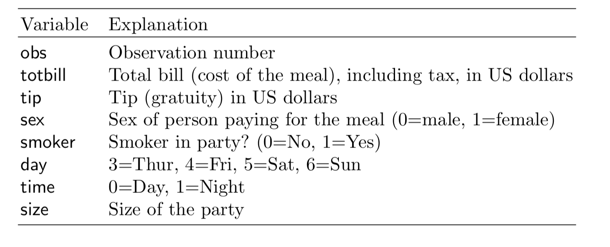

```{r include=FALSE}
# automatically create a bib database for R packages
knitr::opts_chunk$set(
  echo = FALSE,
  warning = FALSE,
  message = FALSE,
  cache = FALSE,
  fig.width = 6,
  fig.height = 4,
  fig.align = "center",
  out.width = "90%",
  fig.retina = 3
)
```

# What is exploratory data analysis? {#what-is-eda}

Data analysis is a process of cleaning, transforming,
inspecting and modelling data with the aim of extracting
information.

Data analysis includes:

* exploratory data analysis,
* confirmatory data analysis, and
* initial data analysis.

<!-- Modeling and prediction and EDA -->
Before modelling and predicting, data should first be explored to uncover the patterns and structures that exist. Exploratory data analysis involves both numerical and visual techniques designed to reveal interesting information that may be hidden in the data. However, an analyst must be cautious not to over-interpret apparent patterns, and to make efforts assess the results of a data exploration are reliable for the data being studied and potentially for new data.

<!-- Inference and EDA -->
In a confirmatory data analysis, the focus is on statistical inference and includes processes such as testing hypothesis, model selection, or predictive modelling. Initial data analysis is an important part of this, to check the sometimes strict assumptions made in order to conduct inference. 

## Current interpretations
<!-- Some common explanations -->
EDA today is prevalent, and there are many descriptions. It's interesting to compare and contrast these, in relation to the original scope. 

From [wikipedia](https://en.wikipedia.org/wiki/Exploratory_data_analysis)

> In statistics, exploratory data analysis (EDA) is an approach to analyzing data sets to summarize their main characteristics, often with visual methods. A statistical model can be used or not, but primarily EDA is for seeing what the data can tell us beyond the formal modeling or hypothesis testing task. 

In @r4ds

> EDA is not a formal process with a strict set of rules. More than anything, EDA is a state of mind. During the initial phases of EDA you should feel free to investigate every idea that occurs to you. Some of these ideas will pan out, and some will be dead ends.

The [National Institute of Standards and Technology](https://www.itl.nist.gov/div898/handbook/eda/section1/eda11.htm)

> Exploratory Data Analysis (EDA) is an approach/philosophy for data analysis that employs a variety of techniques (mostly graphical) to (1) maximize insight into a data set; (2) uncover underlying structure; (3) extract important variables; (4) detect outliers and anomalies; (5) test underlying assumptions; (6) develop parsimonious models; and (7) determine optimal factor settings.

The predictive analytics competition site [Kaggle](https://www.kaggle.com/pavansanagapati/a-simple-tutorial-on-exploratory-data-analysis) says

> What is Exploratory Data Analysis (EDA)? (1) How to ensure you are ready to use machine learning algorithms in a project? (2) How to choose the most suitable algorithms for your data set? (3) How to define the feature variables that can potentially be used for machine learning?

Legacy data analysis software system [SAS](https://seleritysas.com/blog/2020/05/08/exploratory-data-analysis-and-its-role-in-improving-business-operations/) says

> EDA is necessary for the next stage of data research. If there was an analogy to exploratory data analysis, it would be that of a painter examining their tools and available time, before deciding on what best to paint.

The massive online [John Hopkins EDA class](https://www.coursera.org/learn/exploratory-data-analysis#syllabus) describes it as

> These techniques are typically applied before formal modeling commences and can help inform the development of more complex statistical models. Exploratory techniques are also important for eliminating or sharpening potential hypotheses about the world that can be addressed by the data.

General information site [Towards Data Science](https://towardsdatascience.com/if-you-dont-find-anything-new-you-don-t-do-eda-right-d356f9995098) says

> The purpose of doing the Exploratory Data Analysis or EDA is to find new information in data. The understanding of EDA that practitioners may not aware of, is the EDA uses a visually-examined dataset to understand and summarize the main characteristics of the dataset without having a prior hypothesis or relying upon statistical models.

## Differentiating from traditional analysis

### From the case study

In 1995 I (Di), as a newly fledged assistant professor, was asked to teach a Business Statistics course. In the process of looking for appropriate examples, I found a book titled "Practical Data Analysis: Case Studies in Business Statistics" by Bryant and Smith [@bryantsmith1995]. The example on tipping in restaurants caught my eye, because I had always found tipping to be a difficult. Perhaps this was because I was an Australian new to the practice after moving to the USA for graduate school, in 1988 and still uncomfortable with the culture almost a decade later. The types of questions that bounce around mentally, should I tip because the wait staff's wage comes mostly from this money, how much does the restaurant owner take from the worker, was the service good, have I just been paid and can be generous. 

#### What is tipping? {-#whatistipping}

According to [The basic rules of tipping that everyone should know about](https://www.washingtonpost.com/news/going-out-guide/wp/2016/09/15/tipping-can-be-complicated-these-are-the-basic-rules-you-should-know-about/):

- When you're dining at a full-service restaurant
    - Tip 20 percent of your full bill.
- When you grab a cup of coffee
    - Round up or add a dollar if you're a regular or ordered a complicated drink.
- When you have lunch at a food truck
    - Drop a few dollars into the tip jar, but a little less than you would at a dine-in spot.
- When you use a gift card
    - Tip on the total value of the meal, not just what you paid out of pocket.

#### About the data {-#aboutthedata}

The tips case study data is described as follows:

> In one restaurant, a food server recorded the following data on all customers they served during an interval of two and a half months in early 1990.

> Food servers’ tips in restaurants may be influenced by many factors, including the nature of the restaurant, size of the party, and table locations in the restaurant. Restaurant managers need to know which factors matter when they assign tables to food servers.

and a description of the variables is as reported in @cookswayne07:



#### Case study procedure {-#casestudyprocedure}

The analysis of the data should follow these steps according to the book:

- *Step 1*: Develop a model
    - Should the response be `tip` alone and use the total bill as a predictor?
    - Should you create a new variable `tip rate` and use this as the response?
- *Step 2*: Fit the full model with sex, smoker, day, time and size as predictors
- *Step 3*: Refine model: Should some variables should be dropped?
- *Step 4*: Check distribution of residuals
- *Step 5*: Summarise the model, if X=something, what would be the expected tip

#### Step 1 {-#step1}

Calculate tip % as tip/total bill $\times$ 100

```{r}
library(tidyverse)
tips <- read_csv("http://ggobi.org/book/data/tips.csv")
```

```{r echo = TRUE}
tips <- tips %>%
  mutate(tip_pct = tip/totbill * 100) #<<
```

#### Step 2 {-#step2}

Fit the full model with all variables

```{r echo = TRUE}
tips_lm <- tips %>%
  select(tip_pct, sex, smoker, day, time, size) %>%
  lm(tip_pct ~ ., data=.) #<<
```

Summarise the model

```{r modela, echo=TRUE}
library(broom)
library(kableExtra)
tidy(tips_lm) %>% #<<
  kable(digits=2) %>% 
  kable_styling() 
```

```{r modelb, echo=TRUE}
glance(tips_lm) %>% #<<
  select(r.squared, statistic, p.value) %>% 
  kable(digits=3)
```

`r emo::ji("thinking")` Which variable(s) would be considered important for predicting tip %?

#### Step 3 {-#step3}

Refine the model.

```{r model_smalla, echo=TRUE}
tips_lm <- tips %>%
  select(tip_pct, size) %>% #<<
  lm(tip_pct ~ ., data=.) 
tidy(tips_lm) %>% #<<
  kable(digits=2) %>% 
  kable_styling() 
```

$$\widehat{tip %} = 18.44 - 0.92 \times size$$

As the size of the dining party increases by one person the tip decreases by approximately 1%.

```{r model_smallb, echo=TRUE}
glance(tips_lm) %>% #<<
  select(r.squared, statistic, p.value) %>% 
  kable(digits=3)
```

$R^2 = 0.02$.

This dropped by half from the full model, even though no other variables contributed significantly to the model. It might be a good step to examine interaction terms. 

**What does $R^2 = 0.02$ mean?**

$R^2 = 0.02$ means that size explains just 2% of the variance in tip %. This is a very weak model. 

And $R^2 = 0.04$ is also a very weak model.

**What do the $F$ statistic and $p$-value mean?**

Assume that we have a random sample from a population. Assume that the model for the population is 

$$ \widehat{tip %} = \beta_0 + \beta_1 sexM + ... + \beta_7 size $$
and we have observed

$$ \widehat{tip %} = b_0 + b_1  sexM + ... + b_7 size $$
The $F$ statistic refers to 

$$ H_o: \beta_1 = ... = \beta_7 = 0 ~~ vs ~~ H_a: \text{at least one is not 0}$$
The $p$-value is the probability that we observe the given $F$ value or larger, computed assuming $H_o$ is true.

**What do the $t$ statistics and $p$-value associated with model coeficients mean?**

Assume that we have a random sample from a population. Assume that the model for the population is 

$$ \widehat{tip %} = \beta_0 + \beta_1 sexM + ... + \beta_7 size $$
and we have observed

$$ \widehat{tip %} = b_0 + b_1  sexM + ... + b_7 size $$

The $t$ statistics in the coefficient summary refer to 

$$ H_o: \beta_k = 0 ~~ vs ~~ H_a: \beta_k \neq 0 $$
The $p$-value is the probability that we observe the given $t$ value or more extreme, computed assuming $H_o$ is true.

#### Model checking {-#modelchecking}

Normally, the final model summary would be accompanied diagnostic plots

- observed vs fitted values to check strength and appropriateness of the fit
- univariate plot, and normal probability plot, of residuals to check for normality
- in the simple final model like this, the observed vs predictor, with model overlaid would be advised to assess the model relative to the variability around the model
- when the final model has more terms, using a partial dependence plot to check the relative relationship between the response and predictors would be recommended.

```{r res_hist, echo=TRUE}
tips_aug <- augment(tips_lm)
ggplot(tips_aug, 
    aes(x=.resid)) + #<<
  geom_histogram() +
  xlab("residuals") 
```

```{r res_qq, echo=TRUE}
ggplot(tips_aug, 
    aes(sample=.resid)) + #<<
  stat_qq() +
  stat_qq_line() +
  xlab("residuals") +
  theme(aspect.ratio=1)
```

```{r obs_fitted, echo=TRUE}
ggplot(tips_aug, 
    aes(x=.fitted, y=tip_pct)) + #<<
  geom_point() +
  geom_smooth(method="lm") +
  xlab("observed") +
  ylab("fitted")
```

```{r fitted_model, echo=TRUE}
ggplot(tips_aug, 
    aes(x=size, y=tip_pct)) + #<<
  geom_point() +
  geom_smooth(method="lm") +
  ylab("tip %")
```

The result of this work would leave us with a model that could be used to impose a dining/tipping policy in restaurants (see [here](https://travel.stackexchange.com/questions/40543/can-i-refuse-to-pay-auto-gratuity-in-a-restaurant)) and should also leave us with an unease that this policy is based on weak support.

### EDA approach

It's a good idea to examine the data description, and the explanation of the variables. What does that look like here?
- tip and totbill are quantitative, but generally we would think about tip as a percentage of the bill, so creating this new variable would be useful, too.
- sex, smoker, day, time of day are categorical.
- size is discrete/integer.

The types of variables suggest what summaries to make. 

For the quantitative variables we would calculate 
- means, standard deviations, median, quartiles, minimum and maximum, and 
- also make histograms or density plots and scatterplots to explore bivariate relationships.

For categorical variables, and integer variables with few categories, compute 
- counts and proportions, and
- make bar charts and mosaic plots

Thinking about relationships between categorical and quantitative variables, we could 
- calculate the numerical summaries by the categorical variable levels, and 
- make histograms and scatterplots, facetted by the categorical variables.

#### Look at the distribution of tips, total bill. {-#tip}

```{r tips, echo=TRUE}
ggplot(tips, 
    aes(x=tip)) + #<<
  geom_histogram(
    colour="white")  
```

Because, one binwidth is never enough ...

```{r tips2, echo=TRUE}
ggplot(tips, 
    aes(x=tip)) +
  geom_histogram(
    breaks=seq(0.5,10.5,1), #<< 
    colour="white") + 
  scale_x_continuous(
    breaks=seq(0,11,1))
```

Big fat bins. Tips are skewed, which means most tips are relatively small.

```{r tips3, echo=TRUE}
ggplot(tips, 
    aes(x=tip)) + 
  geom_histogram(
    breaks=seq(0.5,10.5,0.1), #<<
    colour="white") +
  scale_x_continuous(
    breaks=seq(0,11,1))
```

Skinny bins. Tips are multimodal, and occurring at the full dollar and 50c amounts.

#### Relationship between tip and total {-#tiptotal}

```{r tips_tot, echo=TRUE}
p <- ggplot(tips, 
    aes(x=totbill, y=tip)) + 
  geom_point() + #<<
  scale_y_continuous(
    breaks=seq(0,11,1))
p
```

Adding a regression line, helps to focus on a tipping standard, and whether individual tips are above or below expected.

```{r tips_tot2, echo=TRUE}
p <- p + geom_abline(intercept=0, #<<
              slope=0.2) + #<<
  annotate("text", x=45, y=10, 
           label="20% tip") 
p
```

Most tips less than 20%, there are more "skin flints" than generous diners. There are a couple of big tips, and we can see the banding horizontally that is the rounding seen from the histogram of tips.


#### Examine the distributions across categorical variables. {-#tipcategorical}

```{r tips_sexsmoke, echo=TRUE}
p + facet_grid(smoker~sex) #<<
```

- The bigger bills tend to be paid by men (and females that smoke).
- Except for three diners, female non-smokers are very consistent tippers, probably around 15-18% though.
- The variability in the smokers is much higher than for the non-smokers.

*Isn't this interesting?*

### Summarising the difference

In the above example we gained a wealth of insight in a short time. Using nothing but graphical methods we investigated univariate, bivariate, and multivariate relationships. We found both global features and local detail. We saw that tips were rounded; then we saw the obvious correlation between the tip and the size of the bill, noting the scarcity of generous tippers; finally we discovered differences in the tipping behavior of male and female smokers and non-smokers.

Notice that we used very simple plots to explore some pretty complex relationships involving as many as four variables. Each plot shows a subset obtained by partitioning the data according to two binary variables. The statistical term for partitioning based on variables is “conditioning.” For example, the top left plot shows the dining parties that meet the condition that the bill payer was a male non-smoker: sex = male and smoking = False. In database terminology this plot would be called the result of "drill-down". The idea of conditioning is richer than drill-down because it involves a structured partitioning of all data as opposed to the extraction of a single partition.

Having generated the four plots, we arrange them in a two-by-two layout to reflect the two variables on which we conditioned. Although the axes in each plot are tip and bill, the axes of the overall figure are smoking (vertical) and sex (horizontal). The arrangement permits us to make several kinds of comparisons and to make observations about the partitions.

### Reality check

The preceding explanations may have given a somewhat misleading impression of the process of data analysis. In our account the data had no problems; for example, there were no missing values and no recording errors. Every step was logical and necessary. Every question we asked had a meaningful answer. Every plot that was produced was useful and informative. In actual data analysis, nothing could be further from the truth. Real datasets are rarely perfect; most choices are guided by intuition, knowledge, and judgment; most steps lead to dead ends; most plots end up in the wastebasket. This may sound daunting, but even though data analysis is a highly improvisational activity, it can be given some structure nonetheless.

### What is EDA?

In this stage in the analysis, we make time to "play in the sand" to allow us to find the unexpected, and come to some understanding of our data. We like to think of this as a little like traveling. We may have a purpose in visiting a new city, perhaps to attend a conference, but we need to take care of our basic necessities, such as finding eating places and gas stations. Some of our movements will be pre-determined, or guided by the advice of others, but some of the time we wander around by ourselves. We may find a cafe we particularly like or a cheaper gas station. This is all about getting to know the neighborhood.

EDA has always depended heavily on graphics, even before the term data visualization was coined. Our favorite quote from John Tukey’s rich legacy is that we need good pictures to *"force the unexpected upon us."*


### Isn't it data snooping?

- Because EDA is very graphical, it sometimes gives rise to a suspicion that patterns in the data are being detected and reported that are not really there. 
- So many different combinations may be examined, that something is bound to be interesting. 
- `r emo::ji("danger")` Structure seen in the plot drives hypothesis testing (on same data).

*Sometimes this is called data snooping.*

We snooped into the tips data, and from a few plots we learned an enormous amount of information about tipping: There is a scarcity of generous tippers, the variability in tips increases extraordinarily for smoking parties, and people tend to round their tips. These are very different types of tipping behaviors than what we learned from the regression model. The regression model was not compromised by what we learned from graphics, and indeed, *we have a richer and more informative analysis. Making plots of the data is just smart.*

**False discovery is the lesser danger when compared to non-discovery. Non-discovery is the failure to identify meaningful structure, and it may result in false or incomplete modeling. In a healthy scientific enterprise, the fear of non-discovery should be at least as great as the fear of false discovery.**

### Why aren't there more resources on EDA?

> Teaching data analysis is not easy, and the time allowed is always far from sufficient. But these difficulties have been enhanced by the view that "avoidance of cookbookery and growth of understanding come only by mathematical treatment, with emphasis upon proofs." The problem of cookbookery is not peculiar to data analysis. But the solution of concentrating upon mathematics and proof is. @tukey1962 

There are many courses now, every introductory statistics course begins with exploratory data analysis, and teaches box plots. It is just a simple treatment, though. A book by [Peng](https://bookdown.org/rdpeng/exdata/), and a [Coursera class by Peng, Leek and Caffo](https://www.coursera.org/learn/exploratory-data-analysis) with more than a 100,000 regularly enrolled. 

<center> <ADD SOFTWARE TOO> </center>

**But we argue that there is something missing from all of this. Almost all of these resources focus on what would be called initial data analysis. These don't capture the spirit of EDA, as introduced by Tukey.**

## The origins of EDA

The field of exploratory data analysis came of age when this book appeared in 1977. 

<center></center>

*Tukey held that too much emphasis in statistics was placed on statistical hypothesis testing (confirmatory data analysis); more emphasis needed to be placed on using data to suggest hypotheses to test.*

::: do

Take a glimpse back in time is possible with the [American Statistical Association video lending library](http://stat-graphics.org/movies/). 

Watch [John Tukey talking about exploring high-dimensional data with an amazing new computer in 1973](https://www.youtube.com/embed/B7XoW2qiFUA), four years before the EDA book. Look out for these things:

- Tukey's expertise is described as *for trial and error learning* and 
- the computing equipment, especially how the human interacted with the screen,
- and the hair style of Jerry Friedman.

The first 4.25 minutes are the best!
:::


## Exercises

1. Make a histogram of the total bill. Is there a similar pattern of multimodality? 

2. In the scatterplot of tip vs total bill, why is total on the horizontal axis?
