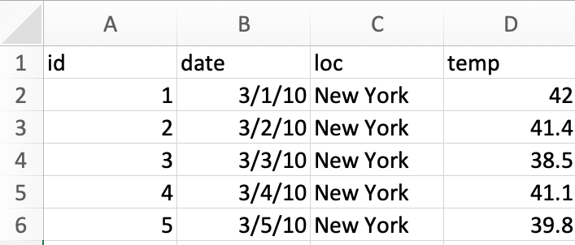

# Initial Data Analysis

In Chapter \@ref(what-is-eda), we mentioned that data analysis includes **initial data analysis** (IDA). There are various definitions of IDA, much like there are numerous definitions for EDA. Some people would be practising IDA without explicitly realising that it is
IDA. Or in other cases, a different name is used to describe the same
process, such as @Chatfield1985 referring to IDA also as "initial
examination of data" and Cox & Snell (1981) as "preliminary data
anlysis" and Rao (1983) as "cross-examination of data". So what is IDA?


```{block, type="aim", echo = TRUE}
The two main objectives for **initial data analysis** are:

1. data description, and
2. model formulation.
```


IDA differs from the main analysis (i.e. usually fitting the
model, conducting significance tests, making inferences or
predictions).
IDA is often unreported in the data analysis reports or
scientific papers due to it being "uninteresting" or "obvious".
The role of the main analysis is to answer the intended
question(s) that the data were collected for.
Sometimes IDA alone is sufficient.

## Data description


Data description should be one of the first steps in the data
analysis to assess the structure and quality of the data. We refer them to occasionally as data sniffing or data scrutinizing. These include using common or domain knowledge to check if the recorded data have sensible values. E.g. Are positive values, e.g. height and weight, recorded as
positive values with a plausible range? If the data are counts, are the recorded values contain noninteger values? For compositional data, do the values add up to 100% (or 1)? If not is that a measurement error or due to rounding? Or is another variable missing?


In addition, numerical or graphical summaries may reveal that
there is unwanted structure in the data. E.g., Does the treatment group have different demographic characteristics to the control group? Does the distribution of the data imply violations of assumptions for the main analysis?

Data sniffing or data scrutinizing is a process that you get better
at with practice and have familiarity with the domain area.

Aside from checking the data structure or data quality, it's
important to check how the data are understood by the
computer, i.e. checking for data type is also important. E.g.,

* Was the date read in as character?
* Was a factor read in as numeric?

### Checking the data type

::: eg 

**Example 1**: Consider the following data stored as an excel sheet.

```{r ex-data-type, echo = FALSE, out.width = "300px"}

```

We read this data into R as below.
```{r}
library(readxl)
df <- read_excel("data/example-data-type.xlsx")
```
Below is a print out of the data object. Are there any issues here?
```{r}
df
```
:::

In the United States, it is common to use the date format MM/DD/YYYY while the rest of the world commonly use DD/MM/YYYY or YYYY/MM/DD. It is highly probable that the dates are 1st-5th March and not 3rd of Jan-May. You can **validate data with external sources**, e.g. say the temperature at New York during the two choices suggest that the dates are 1st-5th March. 

The benefit of working with data grounded in the real world process is that there are generally means to sanity check. You can robustify your workflow by ensuring that you have an explicit check for the expected data type (and values) in your code. 

In the code below, we write our expected types and further coerce some data types to what we want. 

```{r}
library(tidyverse)
read_excel("data/example-data-type.xlsx", 
                   col_types = c("text", "date", "text", "numeric")) %>%
  mutate(id = as.factor(id),
         date = as.character(date),
         date = as.Date(date, format = "%Y-%d-%m"))
```

```{r}
read_csv("data/example-data-type.csv",
         col_types = cols(id = col_factor(),
                          date = col_date(format = "%m/%d/%y"),
                          loc = col_character(),
                          temp = col_double()))
```


The checks (or coercions) ensure that even if the data are updated, you can have some confidence that any data type error will be picked up before further analysis. 


### Checking the data quality

Numerical or graphical summaries, or even just eye-balling the data, helps to uncover some data quality issues. Do you see any issues for the data below?

```{r}
df2 <- read_csv("data/example-data-quality.csv",
                col_types = cols(id = col_factor(),
                                 date = col_date(format = "%m/%d/%y"),
                                 loc = col_character(),
                                 temp = col_double()))
df2
```

There is a missing value in `loc`. Temperature is in Farenheit for New York but Celsius in Melbourne. You can find this out again using external sources. 

::: case

Consider the soybean study conducted in Brazil (cite Lehner 2016). This study collected multiple traits of soybeans grown at multiple locations over years. 

:::

```{r}
library(naniar)
data("lehner.soybeanmold", package = "agridat")
vis_miss(lehner.soybeanmold)
```


Inspecting the data reveals that there are a number of missing values for sclerotia and these values do not necessary appear missing at random. We could check if observational units that are missing values for sclerotia, have different yield say. 

```{r}

ggplot(lehner.soybeanmold, aes(sclerotia, yield)) +
  geom_miss_point()
```

We could also compare the new data with old data. 

```{r}
library(inspectdf)
soy_old <- lehner.soybeanmold %>%
  filter(year %in% 2010:2011)
soy_new <- lehner.soybeanmold %>%
  filter(year == 2012)

inspect_cor(soy_old, soy_new) %>%
  show_plot()
```

### Check on data collection method 


Next we study the data from ABS that shows the total number of people employed in a given month from February 1976 to December 2019 using the original time series.

```{r, message = FALSE}
library(readabs)
employed <- read_abs(series_id = "A84423085A") %>% 
  mutate(month = lubridate::month(date),
         year = factor(lubridate::year(date))) %>% 
  filter(year != "2020") %>% 
  select(date, month, year, value) 
```

Do you notice anything?

```{r, fig.height = 6, fig.width = 12}
employed  %>% 
  ggplot(aes(month, value, color = year)) + 
  geom_line() + 
  ggtitle("1978 Feb - 2019 Dec") 
```

Why do you think the number of people employed is going up each year?

```{r, fig.height = 8, fig.width = 6, echo = FALSE}
df3 <- employed  %>% 
  dplyr::filter(as.numeric(as.character(year)) > 2008) %>% 
  mutate(month = factor(month)) 
ggplot(df3, aes(month, value, group = year)) + 
  geom_line() + 
  geom_text(data = filter(df3, month==12) %>% 
              mutate(month = ifelse(year %in% c(2011, 2013), 14, month)), 
            aes(label = year), hjust = -0.4, size = 5) +
  ggtitle("2009 Jan - 2019 Dec") +
  coord_cartesian(clip = 'off') + 
  theme(plot.margin = unit(c(1,4,1,1), "lines")) 
  
```


There's a suspicious change in August numbers from 2014.

```{r, echo = FALSE}
df3 %>% 
  filter(month %in% 8:9) %>% 
  pivot_wider(year, names_from = month) %>% 
  mutate(diff = `9` - `8`) %>% 
  ggplot(aes(year, diff)) + 
  geom_point() + 
  geom_line(group = 1) +
  guides(x = guide_axis(n.dodge = 2)) + 
  labs(y = "Difference (Sep - Aug)")
```

A potential explanation for this is that there was a _change in the survey from 2014_. Also see https://robjhyndman.com/hyndsight/abs-seasonal-adjustment-2/

**Check if the _data collection_ method has been consistent.**

### Check for experimental data

For experimental data, there would generally be some descriptions that include the experimental layout and any randomisation process of controlled variables (e.g. treatments) to units. 

Consider the experiment below. The experiment tests the effects of 9 fertilizer treatments on the yield of brussel sprouts on a field laid out in a rectangular array of 6 rows and 8 columns.  

```{r}
df3 <- read_csv("data/example-experimental-data.csv", 
                col_types = cols(row = col_factor(),
                                 col = col_factor(),
                                 yield = col_double(),
                                 trt = col_factor(),
                                 block = col_factor()))
```

```{r, echo = FALSE}
library(colorspace)
ggplot(df3, aes(col, row, fill = trt)) + 
  geom_tile(color = "black", size = 2) + 
  coord_equal() +
  scale_fill_discrete_qualitative()

ggplot(df3, aes(col, row, fill = yield)) + 
  geom_tile(color = "black", size = 2) + 
  coord_equal() +
  scale_fill_continuous_sequential(palette = "Greens 3")
```

```{r}
df3 %>% 
  mutate(trt = fct_reorder(trt, yield)) %>% 
  ggplot(aes(trt, yield)) + 
  geom_point(size = 4, alpha = 1 / 2) + 
  guides(x = guide_axis(n.dodge = 2))
```

High sulphur and high manure seems to best for the yield of brussel sprouts. Any issues here? 


## Model formulation

```{block, type="info", echo = TRUE}
Note: there are variety of ways to do IDA and you don't need to prescribe to what we show you.
```

### Review: Linear models in R 

Consider the bivariate data `cars` were it contains the variables `dist` (distance travelled) and `speed` (speed of the car) with the data shown in Figure \@ref(fig:plot-cars).

(ref:plot-cars) The plot of the speed of cars vs. the distance travelled. 

```{r plot-cars, echo = FALSE, warning = FALSE, message = FALSE, fig.cap="(ref:plot-cars)"}
ggplot(cars, aes(dist, speed)) +
  geom_point() + 
  geom_smooth(method = "lm", se = FALSE)
```

thes models can be fitted in R as follows:

```{r fit1, eval = FALSE}
lm(speed ~ dist, data = cars)
```

which is the same as 

```{r fit2, eval = FALSE}
lm(speed ~ 1 + dist, data = cars)
```

and for $i = 1, ... `r nrow(cars)`$ mathematically can be written as 

$$y_i = \beta_0 + \beta_1 x_i + e_i,$$
where: 

* $y_i$ and $x_i$ are the speed (in mph) and stopping distance (in ft), respectively of the $i$-th car,
* $\beta_0$ and $\beta_1$ are intercept and slope, respectively, and 
* $e_i$ is the random error, typically assuming that $e_i \sim N(0, \sigma^2)$. 

## Model formulation

* Say, we are interested in characterising the price of the diamond in terms of its carat. 

```{r plot-diamond, echo = FALSE}
diamonds %>% 
  ggplot(aes(carat, price)) +
  geom_point(alpha = 0.3)
```

Looking at this plot, would you fit a linear model with formula `price ~ 1 + carat`? What about `price ~ poly(carat, 2)` which is the same as fitting:

$$y_i = \beta_0 + \beta_1x_i + \beta_2x_i^2 + e_i.$$
Do we need to modify the assumption of the error distribution? Should we make some transformation before modelling? Are there other candidate models? By the way do you notice a wall like structure for prices at 1, 1.5 and 2 carat?

Notice that we did no formal statistical inference as we initially try to formulate the model. The goal of the main analysis is to characterise the price of a diamond by its carat. This may involve:

* formal inference for model selection, 
* justification of the selected "final" model, and
* fitting the final model. 

There may be in fact far more models considered but discarded at the IDA stage. These discarded models are hardly ever reported. Consequently, majority of reported statistics give a distorted view and it's important to remind yourself what might *not* be reported.

<blockquote>
"All models are approximate and tentative; approximate in the sense that no model is exactly true and tentative in that they may be modified in the light of further data"

-- Chatfield (1985)
</blockquote>

<blockquote>
"All models are wrong but some are useful"

-- George Box
</blockquote>

::: case
A wheat breeding trial to test 107 varieties (also called genotype) is conducted in a field experiment laid out in a rectangular array with 22 rows and 15 columns.

:::

```{r}
data("gilmour.serpentine", package = "agridat")
```

### Experimental Design 

The experiment employs what is referred to as a randomised complete block design (RCBD) (technically it is near-complete and not exactly RCBD due to check varieties have double the replicates of test varieties).

RCBD means that:

* the there are equal number of replicates for each treatment (here it is gen);
* each treatment appears exactly once in each block;
* the blocks are of the same size; and
* each treatment are randomised within block.

In agricultural field experiments, blocks are formed spatially by grouping plots within contiguous areas (called `rep` here).

The boundaries of blocks may be chosen arbitrary.


* In the main analysis, people would commonly analyse this using what is called **two-way ANOVA** model (with no interaction effect).
* The two-way ANOVA model has the form
<center>
<code>yield = mean + block + treatment + error</code>
</center>
* So for this data,
```{r, echo = TRUE}
fit <- lm(yield ~ 1 + rep + gen, 
          data = gilmour.serpentine)
```

```{r, echo = TRUE}
summary(fit)
```

```{r, echo = FALSE}
library(tidycat)
est <- fit %>% 
  broom::tidy() %>% 
  tidy_categorical(fit, include_reference = TRUE) %>% 
  filter(variable == "gen")
```

```{r top10geno-model, echo = FALSE, fig.height = 8, fig.width = 5}
est %>% 
  mutate(gen = fct_reorder(level, estimate)) %>% 
  filter(gen %in% levels(gen)[c(1:10, (107 - 9): 107)]) %>% 
  ggplot(aes(estimate, gen)) + 
  geom_point(size = 2) +
  ggtitle("Top 10 and bottom 10\n genotype by model est.")
```

```{r top10geno-mean, echo = FALSE, fig.height = 8, fig.width = 5}
gilmour.serpentine %>% 
  mutate(gen = fct_reorder(gen, yield, mean)) %>% 
  filter(gen %in% levels(gen)[c(1:10, (107 - 9): 107)]) %>% 
  ggplot(aes(yield, gen)) + 
  geom_point(size = 2) +
  ggtitle("Top 10 and bottom 10\n genotype by mean yield")
```
```{r top10geno-median, echo = FALSE, fig.height = 8, fig.width = 5}
gilmour.serpentine %>% 
  mutate(gen = fct_reorder(gen, yield, median)) %>% 
  filter(gen %in% levels(gen)[c(1:10, (107 - 9): 107)]) %>% 
  ggplot(aes(yield, gen)) + 
  geom_point(size = 2) +
  ggtitle("Top 10 and bottom 10\n genotype by median yield")
```

Do you notice anything from below?

```{r gilmour-plot, echo = FALSE, fig.height = 7, fig.width = 7}
gilmour.serpentine %>% 
  mutate(row = factor(row),
         col = factor(col)) %>% 
  ggplot(aes(col, row, fill = yield)) + 
  geom_tile(color = "black", size = 2) + 
  coord_equal() + 
  scale_fill_continuous_sequential(palette = "Greens 3")
```

* It's well known in agricultural field trials that spatial variations are introduced in traits; this could be because of the fertility trend, management practices or other reasons.
* In the IDA stage, you investigate to identify these spatial variations - you cannot just simply fit a two-way ANOVA model!

<blockquote>
Teaching of Statistics should provide a more balanced blend of IDA and inference

-- Chatfield (1985)
</blockquote>


Yet there is still very little emphasis of it in teaching and also at times in practice. So don't forget to do IDA!


## Summary

* **_Initial data analysis_** (IDA) is a model-focussed exploration of data with two main objectives:
  * **_data description_** including scrutinizing for data quality, and
  * **_model formulation_** without any formal statistical inference.
* IDA hardly sees the limelight even if it's the very foundation of what the main analysis is built on.

