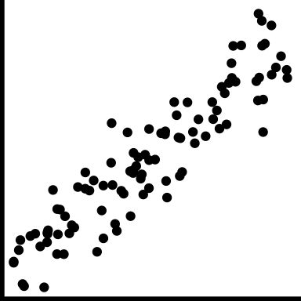
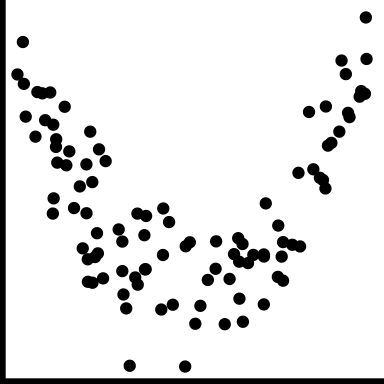
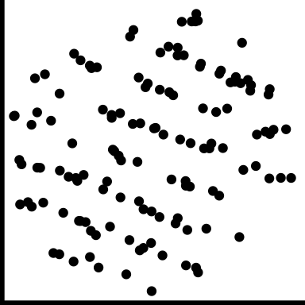

# Bivariate dependencies and relationships

```{r 04-libraries, include = FALSE, message=FALSE}
library(tidyverse)
library(patchwork)
library(VGAMdata)
library(nycflights13)
library(ggplot2movies)
library(datasauRus)
library(gt)
```

## Motivation

<!-- The story of the galloping horse

- My own painting: hills 
- Reflection of lemons
- Green trees

Tendency to repeat what other people have reported, or impose prior beliefs. 

Look again, see with fresh eyes

## The humble scatterplot
-->

> Scatter plots are glorious. Of all the major chart types, they are by far the most powerful. They allow us to .monash-orange2[quickly understand relationships] that would be nearly impossible to recognize in a table or a different type of chart. ... Michael Friendly and Daniel Denis, psychologists and historians of graphics, call the scatter plot the most "generally useful invention in the history of statistical graphics." [Dan Kopf](https://qz.com/1235712/the-origins-of-the-scatter-plot-data-visualizations-greatest-invention/)

::: info
Scatterplots are the natural plot to make to explore association between two **continuous** (quantitative or numeric) variables].
:::

They are not just for linear relationships but are useful for examining nonlinear patterns, clustering and outliers. 

We also can think about scatterplots in terms of statistical distributions: if a histogram shows a marginal distribution, a scatterplot allows us to examine the bivariate distribution of a sample.

### History

Descartes provided the Cartesian coordinate system in the 17$^{th}$ century, with perpendicular lines indicating two axes. 

It wasn't until 1832 that the scatterplot appeared, when [John Frederick Herschel](http://www.datavis.ca/milestones/index.php?group=1800%2B) [@friendly_denis] plotted position and time of double stars.
This is 50 years after [bar charts and line charts](http://www.datavis.ca/milestones/index.php?group=1700s) appeared, used in the work of William Playfair to examine economic data. Kopf argues that *The scatter plot, by contrast, proved more useful for scientists*, but it clearly is useful for economics today.


### Language and terminology

The words "correlation" and "association" are NOT interchangeable. In the English language correlation means a mutual relationship or connection between two things. However, the statistic called correlation ONLY describes linear relationships. 

::: info
If the relationship is NOT linear, call use the term association to describe it. Use the term correlated only for linear relationships to avoid confusion related to the statistic.]
:::


## Common features and their names

```{r scatterplots, echo=FALSE, include = FALSE, fig.width = 2, fig.height = 2}
set.seed(55555)
d_trend <- tibble(x = runif(100) - 0.5) %>%
  mutate(positive=4*x+rnorm(100)*0.5, 
         none=rnorm(100)*0.5, 
         negative=-4*x+rnorm(100)*0.5) %>%
  pivot_longer(cols=positive:negative, names_to="trend", values_to="y") %>%
  mutate(trend = factor(trend, 
                        levels=c("positive", "none", "negative"))) %>%
  select(trend, x, y)

d_trend %>% 
  filter(trend == "positive") %>%
  ggplot(aes(x=x, y=y)) + 
  geom_point() + 
  theme_void() + 
  theme(aspect.ratio = 1, 
        axis.line.x = element_line(color = "black", size = 2),
        axis.line.y = element_line(color = "black", size = 2))

d_trend %>% 
  filter(trend == "negative") %>%
  ggplot(aes(x=x, y=y)) + 
  geom_point() + 
  theme_void() + 
  theme(aspect.ratio = 1, 
        axis.line.x = element_line(color = "black", size = 2),
        axis.line.y = element_line(color = "black", size = 2))

d_trend %>% 
  filter(trend == "none") %>%
  ggplot(aes(x=x, y=y)) + 
  geom_point() + 
  theme_void() + 
  theme(aspect.ratio = 1, 
        axis.line.x = element_line(color = "black", size = 2),
        axis.line.y = element_line(color = "black", size = 2))

d_strength <- tibble(x = runif(100) -0.5) %>%
  mutate(strong=4*x+rnorm(100)*0.5, 
         moderate=4*x+rnorm(100), 
         weak=-4*x+rnorm(100)*3) %>%
  pivot_longer(cols=strong:weak, 
               names_to="strength", values_to="y") %>%
  mutate(strength = factor(strength, 
                           levels=c("strong", "moderate", "weak"))) %>%
  select(strength, x, y)

d_strength %>% 
  filter(strength == "strong") %>%
  ggplot(aes(x=x, y=y)) + 
  geom_point() + 
  theme_void() + 
  theme(aspect.ratio = 1, 
        axis.line.x = element_line(color = "black", size = 2),
        axis.line.y = element_line(color = "black", size = 2))

d_strength %>% 
  filter(strength == "moderate") %>%
  ggplot(aes(x=x, y=y)) + 
  geom_point() + 
  theme_void() + 
  theme(aspect.ratio = 1, 
        axis.line.x = element_line(color = "black", size = 2),
        axis.line.y = element_line(color = "black", size = 2))

d_strength %>% 
  filter(strength == "weak") %>%
  ggplot(aes(x=x, y=y)) + 
  geom_point() + 
  theme_void() + 
  theme(aspect.ratio = 1, 
        axis.line.x = element_line(color = "black", size = 2),
        axis.line.y = element_line(color = "black", size = 2))

```

```{r scatterplots2, echo=FALSE, include = FALSE, fig.width = 2, fig.height = 2}
d_form <- tibble(x = runif(100) -0.5) %>%
  mutate(linear=4*x+rnorm(100)*0.5, 
         nonlinear1=12*x^2+rnorm(100)*0.5,
         nonlinear2=2*x - 5*x^2 +rnorm(100)*0.1) %>%
  pivot_longer(cols=linear:nonlinear2, names_to="form", 
               values_to="y") %>%
  select(form, x, y)

d_form %>% 
  filter(form == "linear") %>%
  ggplot(aes(x=x, y=y)) + 
  geom_point() + 
  theme_void() + 
  theme(aspect.ratio = 1, 
        axis.line.x = element_line(color = "black", size = 2),
        axis.line.y = element_line(color = "black", size = 2))

d_form %>% 
  filter(form == "nonlinear1") %>%
  ggplot(aes(x=x, y=y)) + 
  geom_point() + 
  theme_void() + 
  theme(aspect.ratio = 1, 
        axis.line.x = element_line(color = "black", size = 2),
        axis.line.y = element_line(color = "black", size = 2))

d_form %>% 
  filter(form == "nonlinear2") %>%
  ggplot(aes(x=x, y=y)) + 
  geom_point() + 
  theme_void() + 
  theme(aspect.ratio = 1, 
        axis.line.x = element_line(color = "black", size = 2),
        axis.line.y = element_line(color = "black", size = 2))

d_outliers <- tibble(x = runif(100) -0.5) %>%
  mutate(y=4*x+rnorm(100)*0.5)
d_outliers <- d_outliers %>%
  bind_rows(tibble(x=runif(5)/10-0.45, y=2+rnorm(5)*0.5))

d_outliers %>% 
  ggplot(aes(x=x, y=y)) + 
  geom_point() + 
  theme_void() + 
  theme(aspect.ratio = 1, 
        axis.line.x = element_line(color = "black", size = 2),
        axis.line.y = element_line(color = "black", size = 2))

d_clusters <- tibble(x = c(rnorm(50)/6 - 0.5, 
                           rnorm(50)/6, 
                           rnorm(50)/6 + 0.5)) %>%
  mutate(y=c(rnorm(50)/6,
         rnorm(50)/6+1, rnorm(50)/6))

d_clusters %>% 
  ggplot(aes(x=x, y=y)) + 
  geom_point() + 
  theme_void() + 
  theme(aspect.ratio = 1, 
        axis.line.x = element_line(color = "black", size = 2),
        axis.line.y = element_line(color = "black", size = 2))

d_gaps <- tibble(x = runif(150)) %>%
  mutate(y=runif(150))
d_gaps <- d_gaps %>%
  filter(!(between(x+2*y, 1.2, 1.6)))

d_gaps %>% 
  ggplot(aes(x=x, y=y)) + 
  geom_polygon(data=tibble(x=c(0, 1, 1, 0), y=c(1.2/2, 0.2/2, 0.6/2, 1.6/2)), 
               fill = "red", alpha = 0.3) +
  geom_point() + 
  theme_void() + 
  theme(aspect.ratio = 1, 
        axis.line.x = element_line(color = "black", size = 2),
        axis.line.y = element_line(color = "black", size = 2))

```

```{r scatterplots3, echo=FALSE, include = FALSE, fig.width = 2, fig.height = 2}
d_barrier <- tibble(x = runif(200)) %>%
  mutate(y=runif(200))
d_barrier <- d_barrier %>%
  filter(-x+3*y<1.2)

d_barrier %>% 
  ggplot(aes(x=x, y=y)) + 
  geom_polygon(data=tibble(x=c(0, 1, 1, 0), y=c(1.2/3, 2.2/3, 1, 1)), 
               fill = "red", alpha = 0.3) +
  geom_point() + 
  theme_void() + 
  theme(aspect.ratio = 1, 
        axis.line.x = element_line(color = "black", size = 2),
        axis.line.y = element_line(color = "black", size = 2))

l_shape <- tibble(x = c(rexp(50, 0.01), runif(50)*20), 
                  y = c(runif(50)*20, rexp(50, 0.01)))

l_shape %>% 
  ggplot(aes(x=x, y=y)) + 
  geom_point() + 
  theme_void() + 
  theme(aspect.ratio = 1, 
        axis.line.x = element_line(color = "black", size = 2),
        axis.line.y = element_line(color = "black", size = 2))

discrete <- tibble(x = rnorm(200)) %>%
  mutate(y = -x+rnorm(25)*0.1 + rep(0:7, 25)) %>%
  filter((scale(x)^2 + scale(y)^2) < 2)

discrete %>% 
  ggplot(aes(x=x, y=y)) + 
  geom_point() + 
  theme_void() + 
  theme(aspect.ratio = 1, 
        axis.line.x = element_line(color = "black", size = 2),
        axis.line.y = element_line(color = "black", size = 2))

hetero <- tibble(x = runif(200)-0.5) %>%
  mutate(y = -2*x+rnorm(200)*(x+0.5))

hetero %>% 
  ggplot(aes(x=x, y=y)) + 
  geom_point() + 
  theme_void() + 
  theme(aspect.ratio = 1, 
        axis.line.x = element_line(color = "black", size = 2),
        axis.line.y = element_line(color = "black", size = 2))
  
weighted <- tibble(x = runif(50)-0.5) %>%
  mutate(y = -2*x+rnorm(50)*0.8, 
         w = runif(50)*(x+0.5))

weighted %>% 
  ggplot(aes(x=x, y=y, size=w+0.1)) + 
  geom_point(alpha=0.7) + 
  scale_size_area(max_size=6) +
  theme_void() + 
  theme(aspect.ratio = 1, legend.position = "none",
        axis.line.x = element_line(color = "black", size = 2),
        axis.line.y = element_line(color = "black", size = 2))

```


```{r feature-table, echo=FALSE}
tribble(~Feature, ~Example, ~Description,
        "positive trend", '',  "Low value corresponds to low value, and high to high.",
        "negative trend", '', "Low value corresponds to high value, and high to low.",
        "no trend", '', 'No relationship',
        "strong", '',  "Very little variation around the trend",
        "moderate", '', "Variation around the trend is almost as much as the trend",
        "weak", '', 'A lot of variation making it hard to see any trend',
        "linear form", '',  "The shape is linear",
        "nonlinear form", '', "The shape is more of a curve",
        "nonlinear form", '', 'The shape is more of a curve',
        "outliers", '', 'There are one or more points that do not fit the pattern on the others',
        "clusters", '', 'The observations group into multiple clumps',
        "gaps", '', 'There is a gap, or gaps, but its not clumped',
        "barrier", '', 'There is combination of the variables which appears impossible',
        "l-shape", '', 'When one variable changes the other is approximately constant',
        "discreteness", '', 'Relationship between two variables is different from the overall, and observations are in a striped pattern',
        "heteroskedastic", '', 'Variation is different in different areas, maybe depends on value of x variable',
        "weighted", '', 'If observations have an associated weight,  reflect in scatterplot, e.g. bubble chart'
) %>% 
  knitr::kable(escape = FALSE) %>% 
  kableExtra::kable_classic()
```

- **Weighted** doesn't fit structure table, but its there to remind us not to forget about weighted data
- **causation**: one variable has a direct influence on the other variable, in some way. For example, people who are taller tend to weigh more. The dependent variable is conventionally on the y axis. *It's not generally possible to tell from the plot that the relationship is causal, which typically needs to be argued from other sources of information.*
- **association**: variables may be related to one another, but through a different variable, eg ice cream sales are positively correlated with beach drownings, is most likely a temperature relationship.
- **conditional relationships**: the relationship between variables is conditionally dependent on another, such as income against age likely has a different relationship depending on retired or not.

### Anscombe's quartet

```{r anscombe, echo=FALSE, fig.width=6, fig.height=2, out.width="100%"}
anscombe_tidy <- anscombe %>% 
  pivot_longer(cols=x1:y4, names_to = "var", values_to = "value") %>%
  mutate(group = substr(var, 2, 2), 
         var = substr(var, 1, 1), 
         id = rep(1:11, rep(8, 11))) %>%
  pivot_wider(id_cols = c(id, group), names_from = var, 
              values_from = value) 
anscombe_tidy %>%
  ggplot(aes(x=x, y=y)) + 
    geom_point(colour="orange", size=3) +
    facet_wrap(~group, ncol=4, scales="free") +
    theme(aspect.ratio=1, 
          axis.text.x = element_blank(),
          axis.text.y = element_blank())
```

All four sets of Anscombe has .monash-orange2[same means, standard deviations and correlations], $\bar{x}$ = `r mean(anscombe$x1)`, $\bar{y}$ = `r round(mean(anscombe$y1),1)`, $s_x$ = `r round(sd(anscombe$x1),1)`, 
$s_y$ = `r round(sd(anscombe$y1),1)`, $r$ = `r round(cor(anscombe$x1, anscombe$y1), 2)`.


### DatasauRus dozen

```{r dinosaur, echo=FALSE, out.width="30%", fig.width=3, fig.height=2.8}
datasaurus_dozen %>% filter(dataset == "dino") %>% 
  ggplot(aes(x=x, y=y)) + 
  geom_point() +
  theme(aspect.ratio=1, 
       axis.text.x = element_blank(),
       axis.text.y = element_blank())
  
```

```{r datasaurus, echo=FALSE, fig.height = 7, fig.width = 7, out.width="60%"}

datasaurus_dozen %>% filter(dataset != "dino") %>% ggplot(aes(x=x, y=y)) + 
  geom_point() +
  facet_wrap(~dataset, ncol=4) +
  theme(aspect.ratio=1, 
          axis.text.x = element_blank(),
          axis.text.y = element_blank())
```

All 13 sets of the datasaurus dozen have .monash-orange2[same means, standard deviations and correlations], $\bar{x}$ = `r d <- datasaurus_dozen_wide; round(mean(d$dino_x),0)`, $\bar{y}$ = `r round(mean(d$dino_y),0)`, $s_x$ = `r round(sd(d$dino_x),0)`, 
$s_y$ = `r round(sd(d$dino_y),0)`, $r$ = `r round(cor(d$dino_x, d$dino_y),2)`.


## Case study 1: olympics

```{r olydata, echo=FALSE, warning = FALSE}
data(oly12, package = "VGAMdata")
glimpse(oly12)
oly12 <- oly12 %>% 
  mutate(Sport = as.character(Sport)) %>%
  mutate(Sport = ifelse(grepl("Cycling", Sport), #<<
                        "Cycling", Sport)) %>%  #<<
  mutate(Sport = ifelse(grepl("Gymnastics", Sport),
                        "Gymnastics", Sport)) %>% 
  mutate(Sport = ifelse(grepl("Athletics", Sport),
                        "Athletics", Sport)) %>% 
  mutate(Sport = as.factor(Sport))

```

```{r 2012-olympics-plot1, echo=FALSE, warning = FALSE, fig.width = 6.4}
ggplot(oly12, aes(x=Height, y=Weight, label=Sport)) + 
  geom_point() 
```

* `Warning message: Removed 1346 rows containing missing values (geom_point)`
* The expected linear relationship between height and weight is visible, although obscured by outliers.
* Some discretization of heights, and higher weight values. 
* Likely to be substantial overplotting (57 athletes 1.7m, 60kg can't tell this from this plot). 
* Note the unusual height-weight combinations. What sport(s) would you expect some of these athletes might be participating in?

::: do
Your turn, cut and paste the code into your R console, and `r anicon::nia("mouse over", size=2, animate="ring", speed="slow", colour="#D93F00", anitype="hover")` the resulting plot to examine the sport of the athlete. 

```{r echo=FALSE, warning = FALSE, fig.width = 12, fig.height=8, out.width="100%", eval=FALSE, echo=TRUE}
library(tidyverse) 
library(plotly) 
data(oly12, package = "VGAMdata") 
p <- ggplot(oly12, aes(x=Height, y=Weight, label=Sport)) + 
  geom_point()
ggplotly(p) 
```
:::

### How many athletes in the different sports? 

```{r oly_smry, echo=FALSE, warning = FALSE}
oly12 %>% 
  count(Sport, sort=TRUE) %>%
  gt() 
```

### Consolidate factor levels

There are several cycling events that are reasonable to combine into one category. Similarly for gymnastics and athletics. 


```{r oly_cat, echo=TRUE, warning = FALSE}
oly12 <- oly12 %>% 
  mutate(Sport = as.character(Sport)) %>%
  mutate(Sport = ifelse(grepl("Cycling", Sport), #<<
                        "Cycling", Sport)) %>%  #<<
  mutate(Sport = ifelse(grepl("Gymnastics", Sport),
                        "Gymnastics", Sport)) %>% 
  mutate(Sport = ifelse(grepl("Athletics", Sport),
                        "Athletics", Sport)) %>% 
  mutate(Sport = as.factor(Sport))
```

### Split by sport

```{r oly_facet, echo=FALSE, warning = FALSE, out.width="70%", fig.width=12, fig.height=7}
ggplot(oly12, aes(x=Height, y=Weight)) + 
  geom_point(alpha=0.5) + #<<
  facet_wrap(~Sport, ncol=8) +
  theme(aspect.ratio = 1) #<<
```

Note: alpha transparency, and aspect ratio


- Some sports have no data for height, weight
- The positive association between height and weight is visible across sports
- Nonlinear in wrestling?
- An outlier in judo, and football, and archery
- Maybe flatter among swimmers
- Taller in basketball, volleyball and handball
- Shorter in athletics, weightlifting and wrestling
- Little variance in tennis players
- *It's still messy, and hard to digest*

Things to do to make comparisons easier:

- Remove sports with missings
- Make regression lines for remaining sports on one plot
- Separately examine male/female athletes
- Compare just one group against the rest

### Remove missings, add colour for sex 

```{r oly_women, echo=FALSE, warning = FALSE, out.width="70%", fig.width=12, fig.height=7}
oly12 %>%
  filter(!(Sport %in% c("Boxing", "Gymnastics", "Synchronised Swimming", "Taekwondo", "Trampoline"))) %>%
  mutate(Sport = fct_drop(Sport)) %>%
  ggplot(aes(x=Height, y=Weight, colour=Sex)) + 
  geom_point(alpha=0.5) + 
  facet_wrap(~Sport, ncol=7, scales="free") +
  scale_colour_brewer("", palette="Dark2") +
  theme(aspect.ratio = 1, 
        axis.text.x = element_blank(),
        axis.text.y = element_blank()) 
```

Note: Because the focus is now on males vs females association shape within sport, make plots scale separately.

- Athletics category should have been broken into several more categories like track, field: a shot-putter has a very different physique to a sprinter.
- Generally, clustering of male/female athletes
- Outliers: a tall skinny male archer, a medium height very light female athletics athlete, tall light female weightlifter, tall light male volleyballer
- Canoe slalom athletes, divers, cyclists are tiny.

### Comparing association

```{r oly_model, echo=FALSE, warning = FALSE, out.width="100%", fig.width=10, fig.height=8}
oly12 %>%
  filter(Sport %in% c("Swimming", "Archery", "Basketball",
                      "Handball", "Hockey", "Tennis",
                      "Weightlifting", "Wrestling")) %>%
  filter(Sex == "F") %>%
  mutate(Sport = fct_drop(Sport), Sex=fct_drop(Sex)) %>%
  ggplot(aes(x=Height, y=Weight, colour=Sport)) + 
  geom_smooth(method="lm", se=FALSE) + #<<
  scale_colour_brewer("", palette="Dark2") +
  theme(legend.position = "bottom",
        legend.direction = "horizontal")
```

- Weightlifters are much heavier relative to height
- Swimmers are leaner relative to height
- Tennis players are a bit mixed, shorter tend to be heavier, taller tend to be lighter

### Comparing variability

```{r oly_density, echo=FALSE, warning = FALSE, out.width="100%", fig.width=10, fig.height=8}
oly12 %>%
  filter(Sport %in% c("Shooting", "Modern Pentathlon", "Basketball")) %>% #<<
  filter(Sex == "F") %>%
  mutate(Sport = fct_drop(Sport), Sex=fct_drop(Sex)) %>%
  ggplot(aes(x=Height, y=Weight, colour=Sport)) + 
  geom_density2d() + #<<
  scale_colour_brewer("", palette="Dark2") +
  theme(legend.position = "bottom",
        legend.direction = "horizontal")
```

- Modern pentathlon athletes are uniformly height and weight related
- Shooters are quite varied in body type

### Summary

We have seen that the association between height and weight is "contaminated" by different variables, sport, gender, and possibly country and age, too. 

Some of the categories also are "contaminated", for example, "Athletics" is masking many different types of events. This **lurking** variable probably contributes to different relationships depending on the event. There is another variable in the data set called `Event`. Athletics could be further divided based on key words in this variable. 

::: question
If you were just given the Height and Weight in this data could you have detected the presence of conditional relationships? Can you see the conditional dependencies?
:::

```{r oly_canyousee, echo=FALSE, warning = FALSE, fig.width=8, fig.height=8, out.width="70%"}
p1 <- ggplot(oly12, aes(x=Height, y=Weight)) + 
  geom_point(alpha=0.2, size=4) +
  theme_minimal() + theme(aspect.ratio=1)
p2 <- ggplot(oly12, aes(x=Height, y=Weight)) + 
  geom_density2d_filled() +
  theme_minimal() + 
  theme(legend.position="none", aspect.ratio=1) 
p3 <- ggplot(oly12, aes(x=Height, y=Weight)) + 
  geom_density2d(binwidth=0.01) +
  theme_minimal() + theme(aspect.ratio=1)
p4 <- ggplot(oly12, aes(x=Height, y=Weight)) + 
  geom_density2d(binwidth=0.001, color = "white", size=0.2) +
  geom_density2d_filled(binwidth=0.001) +
  theme_minimal() + 
  theme(legend.position="none", aspect.ratio=1) 
p1 + p3 + p2 + p4
```

There is a hint of multimodality, barely a hint. It's not easy to detect the presence of the additional variable, and thus accurately describe the relationship between height and weight among Olympic athletes.

### Scatterplot modifications and purpose

```{r generate_data, echo=FALSE}
set.seed(2222)
df <- tibble(x=c(rnorm(500)*0.2, runif(300)+1)) %>%
  mutate(x2=c(rnorm(500), runif(300)-0.5),
         y1=c(-2*x[1:500]+rnorm(500), 
              3*x[501:800] + rexp(300)), 
         y2=c(rep("A", 500), rep("B", 300)),
         y3=c(-2*(x2[1:500]) + rnorm(500)*2, 
              2*(x2[501:800]) + rnorm(300)*0.5))
```

```{r scatmodify, include=FALSE, fig.width=2, fig.height=2, out.width="100%"}
ggplot(df, aes(x=x2, y=y3)) +
  geom_point() + xlab("") + ylab("") +
  theme_void() + 
  theme(aspect.ratio = 1, 
        axis.line.x = element_line(color = "black", size = 2),
        axis.line.y = element_line(color = "black", size = 2))

ggplot(df, aes(x=x2, y=y3)) + 
  geom_point(alpha=0.1) + xlab("") + ylab("") +
  theme_void() + 
  theme(aspect.ratio = 1, 
        axis.line.x = element_line(color = "black", size = 2),
        axis.line.y = element_line(color = "black", size = 2))

ggplot(df, aes(x=x2, y=y3)) +
  geom_smooth(colour="purple", se=F, size=2, span=0.2) + xlab("") + ylab("") +
  theme_void() + 
  theme(aspect.ratio = 1, 
        axis.line.x = element_line(color = "black", size = 2),
        axis.line.y = element_line(color = "black", size = 2))

ggplot(df, aes(x=x2, y=y3)) +
  geom_point(alpha=0.2) +
  geom_smooth(colour="purple", se=F, size=2, span=0.2) + 
  xlab("") + ylab("") +
  theme_void() + 
  theme(aspect.ratio = 1, 
        axis.line.x = element_line(color = "black", size = 2),
        axis.line.y = element_line(color = "black", size = 2))

ggplot(df, aes(x=x, y=y1)) +
  geom_density_2d(colour="black") + xlab("") + ylab("") +
  theme_void() + 
  theme(aspect.ratio = 1, 
        axis.line.x = element_line(color = "black", size = 2),
        axis.line.y = element_line(color = "black", size = 2))

ggplot(df, aes(x=x, y=y1)) +
  geom_density_2d_filled() + xlab("") + ylab("") +
  theme_void() + 
  theme(legend.position="none", aspect.ratio = 1, 
        axis.line.x = element_line(color = "black", size = 2),
        axis.line.y = element_line(color = "black", size = 2))

ggplot(df, aes(x=x, y=y1, colour=y2)) +
  geom_point(alpha=0.2) + xlab("") + ylab("") +
  scale_colour_brewer("", palette="Dark2") +
  theme_void() + 
  theme(legend.position="none", aspect.ratio = 1, 
        axis.line.x = element_line(color = "black", size = 2),
        axis.line.y = element_line(color = "black", size = 2))

ggplot(df, aes(x=x, y=y1, colour=y2)) +
  geom_density2d() + xlab("") + ylab("") +
  scale_colour_brewer("", palette="Dark2") + 
  theme_void() + 
  theme(legend.position="none", aspect.ratio = 1, 
        axis.line.x = element_line(color = "black", size = 2),
        axis.line.y = element_line(color = "black", size = 2))
```

```{r feature-table4, echo=FALSE}
tribble(~Modification, ~Example, ~Purpose,
        "none", '', 'raw information',
        "alpha-blend", '', 'alleviate overplotting to examine density at centre',
        "model overlay", '', 'focus on the trend',
        "model + data", '', 'trend plus variation',
        "density", '', 'overall distribution, variation and clustering',
        "filled density", '', 'high density locations in distribution (modes), variation and clustering',
        "colour", '', 'relationship with conditioning and lurking variables',
        "colour + density", '', 'relationship with conditioning and lurking variables'
) %>% 
  knitr::kable(escape = FALSE) %>% 
  kableExtra::kable_classic()
```

::: do
**About the Olympics 2012 data**

- What can this data be used for?
- What's the population?
- What could be informed by what is learned from this sample?
:::

## Case study 2: movies

## Case study 3: cars

## Case study 4: soils

## Case study 5: COVID 

## Checking association with permutations


transformations to linearise

## Exercises

1. For each of the following scatterplots, of different Olympic athlete's height and weight identify the visible features, and which is the most surprising.

```{r echo=FALSE, warning = FALSE}
q1a <- oly12 %>% 
  filter(Sport == "Wrestling", 
         Sex == "F") %>%
  ggplot(aes(x=Height, y=Weight)) + 
  geom_point(alpha=0.9, size=3)  +
  ggtitle("Women's wrestling") +
  theme(aspect.ratio=1)
q1b <- oly12 %>% 
  filter(Sport == "Sailing", 
         Sex == "M") %>%
  ggplot(aes(x=Height, y=Weight)) + 
  geom_point(alpha=0.9, size=3)  +
  ggtitle("Men's sailing") +
  theme(aspect.ratio=1)
q1c <- oly12 %>% 
  filter(Sport == "Archery", 
         Sex == "F") %>%
  ggplot(aes(x=Height, y=Weight)) + 
  geom_point(alpha=0.9, size=3)  +
  ggtitle("Female archery") +
  theme(aspect.ratio=1)
q1d <- oly12 %>% 
  filter(Sport == "Rowing", 
         Sex == "F") %>%
  ggplot(aes(x=Height, y=Weight)) + 
  geom_point(alpha=0.9, size=3)  +
  ggtitle("Female rowing") +
  theme(aspect.ratio=1)
q1a + q1b + q1c + q1d
```

<!--
a. positive linear association, discreteness. Most surprising is the discreteness, probably due to weight limits on competition groups.
b. positive linear association, discreteness in both x and y, hint of clumpiness, increasing variance as both x and y increase. Probably the most surprising is the discreteness in both directions. Is there a height limit for some roles on the boat?
c. positive linear association, outlier. The outlier is the most surprising it is a tall and extra heavy archer.
d. positive linear association, clumpiness. Probably some positions in the crew are smaller people, the coxswain. 
-->

2. Guess the correlation between the two variables in each of the previous scatterplots. 

```{r eval=FALSE, echo=FALSE, warning = FALSE}
oly12 %>% 
  filter(Sport == "Wrestling", 
         Sex == "F") %>% 
  select(Height, Weight) %>%
  correlate()
oly12 %>% 
  filter(Sport == "Sailing", 
         Sex == "M") %>%
  select(Height, Weight) %>%
  correlate()
oly12 %>% 
  filter(Sport == "Archery", 
         Sex == "F") %>%
  select(Height, Weight) %>%
  correlate()
oly12 %>% 
  filter(Sport == "Rowing", 
         Sex == "F") %>%
  select(Height, Weight) %>%
  correlate()

```

3. From the following scatterplot, of diamond size and price, what are the most prominent features? 

```{r echo=FALSE, warning = FALSE}
set.seed(344)
diamonds_small <- diamonds %>%
  sample_n(1000)
ggplot(diamonds_small, 
       aes(x=carat, y=price)) +
  geom_point()
```

<!--
positive nonlinear association, heteroskedasticity, outliers, gaps or clumping.
-->

4. In the previous plot of diamonds, what transformation would be recommended based on the "circle of transformations"?

<!-- transform price, down the ladder of powere -->

5. In the following plot of arrival delay and departure delay of flights into and out of the New York City area, what are the most prominent features? 

```{r echo=FALSE, warning = FALSE}
ggplot(flights, 
       aes(x=dep_delay, y=arr_delay)) +
  geom_point()
```

<!--
strong positive association, barrier (arrival delays are not possible to be less than some function of departure delays, might depend on length of flight), heteroskedastic
-->

6. Which of these would be a surprising feature learned from this plot? Why?

- There are negative departure and arrival delays <!-- A bit surprising, but mostly these are small, so some flights leave a fraction early which could happen if all passengers are on board. Early arriving flights are common. -->
- If a flight has a delay in departure it likely will be delayed on arrival <!-- Not surprising, because most likely a flight will be delayed arriving if it started late. -->
- Some flights with negative departure delay have long arrival delays <!-- This is the most surprising, because it means a flight left early but arrived quite late. Physics-wise an early departure should lead to an early arrival. So it makes one think about how the flight could arrive quite late: diverted to avoid a storm, or sat on tarmac after pushing back from gate, or before getting to gate. Requires you to know that departure and arrival times are from and to the gate. -->
- Some flights have long delays <!-- This is reasonably common so it's not surprising.-->
- Some flights with negative arrival delays have positive departure delays <!-- Not so surprising, because a plane can catch up to schedule in-flight. -->

7. A dominant feature in the plot of average rating by number of ratings of  movies in the IMDB database is a barrier, or two barriers, both top and bottom of plot. What is a plausible explanation for this feature?

```{r echo=FALSE, warning = FALSE}
ggplot(movies, aes(x=votes, y=rating)) +
  geom_point() + 
  scale_y_continuous("rating", breaks = seq(0, 10, 2))
```

- As movies become more popular ratings invariably go down <!-- This makes no sense. If it's popular then it will be mostly rated highly. --> 
- There are just very few frequently rated movies and this means it is unlikely to see high values. <!-- A nonsense statement -->
- The lesser rated movies have a lot of variance in their ratings, producing a barrier for the more frequently rated movies. <!-- We could remove the lesser rates movies, and the barrier for frequently rated movies would still exist. -->
- The lesser rated movies have a lot of variance in their ratings, producing a barrier for the more frequently rated movies. <!-- Generally, it is the case that skewness will appear in a plot as less variance in the sparser plot regions. But that is not the pattern causing the barrier in the movies plot. -->
- The average of many values tends to be unlikely to be at the highest and lowest possible values. <!-- This is correct, is a number crunching phenomenon, regression to the mean (?)  -->
