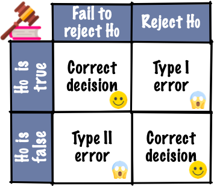

# Is what you see really there?

## Revisiting hypothesis testing

```{r coin}
set.seed(1)
head <- ''
tail <- ''
```

### Testing coin bias

* Suppose I have a coin that I'm going to flip `r tail` 
* If the coin is unbiased, what is the probability it will show heads?
* Yup, the probability should be 0.5. 
* So how would I test if a coin is biased or unbiased?
* We'll collect some data. 
* **Experiment 1**: I flipped the coin 10 times and this is the result:

```{r coin-bias, results='asis'}
samp10 <- sample(rep(c(head, tail), c(7, 3)))
cat(paste0(samp10, collapse = ""))
```
* The result is 7 head and 3 tails. So 70% are heads. 
* Do you believe the coin is biased based on this data?
* **Experiment 2**: Suppose now I flip the coin 100 times and this is the outcome:
```{r coin-bias100, results='asis'}
samp100 <- sample(rep(c(head, tail), c(70, 30)))
cat(paste0(samp100, collapse = ""))
```
* We observe 70 heads and 30 tails. So again 70% are heads. 
* Based on this data, do you think the coin is biased?

## (Frequentist) hypotheses testing framework

* Suppose $X$ is the number of heads out of $n$ independent tosses.
* Let $p$ be the probability of getting a head for this coin.

|     |     |
|-----|-----|
|**Hypotheses**  | $H_0: p = 0.5$ vs. $H_1: p \neq 0.5$   |
|**Assumptions**  | Each toss is independent with equal chance of getting a head.   |
|**Test statistic** | $X \sim B(n, p)$. Recall $E(X) = np$.<br> The observed test statistic is denoted $x$. |
|**P-value** <br>.font_small[(or critical value or confidence interval)] | $P(\mid X - np\mid \geq \mid x - np\mid )$ |
|**<i class="fas fa-gavel"></i> Conclusion** | Reject null hypothesis when the $p$-value is less than<br> some significance level $\alpha$. Usually $\alpha = 0.05$.|

* The p-value for experiment 1 is $P(|X - 5| \geq 2) \approx 0.34$.
* The p-value for experiment 2 is $P(|X - 50| \geq 20) \approx 0.00008$.

## Judicial system

```{r}
knitr::include_graphics("images/judicial-court.png")
```
```{r}

```

* Evidence by test statistic
* Judgement by p-value, critical value or confidence interval
* Does the test statistic have to be a *numerical summary statistics*?

## Visual inference

* Hypothesis testing in visual inference framework is where:
   * <i class="fas fa-search"></i>  the **_test statistic is a plot_** and 
   * <i class="fas fa-gavel"></i> judgement is by human perceptions.

A residual plot after modelling high-density lipoprotein in human blood.


```{r HDL-resplot, fig.height = 5}
samples <- read_csv(here::here("data/HDLsamples.csv"))
fit <- lm(HDL ~ cholesterol + trigylceride + SPB, data = samples)
df <- augment(fit)
ggplot(df, aes(.fitted, .std.resid)) + 
  geom_point() + 
  geom_hline(yintercept = 0, linetype = "dashed") +
  labs(x = "Fitted values", y = "Studentised residuals")
```

* You (and many other people) actually do visual inference many times but generally in an informal fashion.
* Here, we are making an inference on whether the residual plot has any patterns based on a single data plot.

* Data plots tend to be over-interpreted
* Reading data plots require calibration

## Visual inference more formally

1. State your null and alternate hypotheses.
2. Define a <b>visual test statistic</b>, $V(.)$, i.e. a function of a sample to a plot.
3. Define a <b>null generating method</b> to generate <b>null data</b>, $\boldsymbol{y}_0$. 
4. $V(\boldsymbol{y})$ maps the actual data, $\boldsymbol{y}$, to the plot. We call this the <b class="monash-blue">data plot</b>.
5. $V(\boldsymbol{y}_0)$ maps a null data to a plot of the same form. We call this the <b class="monash-blue">null plot</b>. We repeat this $m - 1$ times to generate $m-1$ null plots. 
6. A <b class="monash-blue">lineup</b> displays these $m$ plots in a random order. 
7. Ask $n$ human viewers to select a plot in the lineup that looks different to others without any context given.


1. State your null and alternate hypotheses.
2. Define a **visual test statistic**, $V(.)$, i.e. a function of a sample to a plot.
3. Define a **null generating method** to generate **null data**, $\boldsymbol{y}_0$. 
4. $V(\boldsymbol{y})$ maps the actual data, $\boldsymbol{y}$, to the plot. We call this the .monash-blue[**data plot**].
5. $V(\boldsymbol{y}_0)$ maps a null data to a plot of the same form. We call this the .monash-blue[**null plot**]. We repeat this $m - 1$ times to generate $m-1$ null plots. 
6. A .monash-blue[**lineup**] displays these $m$ plots in a random order. 
7. Ask $n$ human viewers to select a plot in the lineup that looks different to others without any context given.

Suppose $x$ out of $n$ people correctly identified the data plot from a lineup, then
* the **visual inference p-value** is given as $$P(X \geq x)$$ where $X \sim B(n, 1/m)$, and 
* the .monash-blue[**power of a lineup**] is estimated as $x/n$.

## Uniformity trial of peanuts

```{r peanut-data, include = FALSE}
data(bancroft.peanut.uniformity, package = "agridat")
skimr::skim(bancroft.peanut.uniformity)
```
```{r peanut-plot, fig.height = 6, fig.width = 6}
ggplot(bancroft.peanut.uniformity, aes(factor(col), factor(row), fill = yield)) + 
  geom_tile(color = "black", size = 2) + 
  facet_wrap(~block) +
  scale_fill_continuous_sequential(palette = "YlGn") +
  labs(x = "Column", y = "Row", fill = "Yield")
```
```{r peanut-plot2, fig.height = 2, fig.width = 6}
ggplot(bancroft.peanut.uniformity, aes(yield)) + 
  geom_histogram() + 
  facet_wrap(~block) +
  labs(x = "Yield")
```

* Same peanut variety planted in Alabama field in two blocks of rectangular array of 18 rows by 6 plots.
* The yield (in pounds) is measured. 
* Are the yields from the two blocks similar?

```{r peanut-numbers}
bancroft.peanut.uniformity %>% 
  group_by(block) %>% 
  summarise(Mean = mean(yield), SD = sd(yield)) %>% 
  knitr::kable(col.names = c("Block", "Mean", "Std. Dev"),
              digits = 3) 
```

```{r peanut-ttest}
with(bancroft.peanut.uniformity, 
     t.test(yield[block=="B1"], yield[block=="B2"]))
```

1. $H_0: \mu_1 = \mu_1 \quad \text{ vs. } \quad H_1: \mu_1 \neq \mu_2$ where $\mu_1$ and $\mu_2$ are yield means of block 1 and 2, respectively.
2. We choose our visual test statistic $V_1$ as a side-by-side boxplots of yield by block.
3. We generate the null data from $N(\bar{y}, s^2)$ where $\bar{y}$ and $s$ are the sample mean and sample standard deviation of the yields.

```{r peanut-lineup, fig.height = 8, fig.width = 13}
library(nullabor)
set.seed(1)
method <- null_dist("yield", dist = "norm", 
                    params = list(mean = mean(bancroft.peanut.uniformity$yield),
                                  sd = sd(bancroft.peanut.uniformity$yield)))
lineup1 <- lineup(method, true = bancroft.peanut.uniformity, n = 10)
lineup1 %>% 
  ggplot(aes(block, yield)) +
  geom_boxplot() +
  facet_wrap(~.sample, nrow = 2) +
  theme(axis.text = element_blank(),
        axis.title = element_blank())
# decrypt("bhMq KJPJ 62 sSQ6P6S2 um")
# kyuu
```

* So <span contenteditable="true">&nbsp;&nbsp; $x$ &nbsp;&nbsp;</span> out of <span contenteditable="true">&nbsp;&nbsp; $n$ &nbsp;&nbsp;</span> of you chose the data plot.
* So the visual inference p-value is $P(X \geq x)$ where $X \sim B(n, 1/10)$.
* In R, this is 
```r
1 - pbinom(x - 1, n, 1/10) 
# OR 
nullabor::pvisual(x, n, 10)
```
* The power of the lineup is given as 
```r
x/n
# OR (need to use development one)
# install.packages("devtools")
# devtools::install_github("dicook/nullabor")
tibble(pic_id = 1, id = 1:n, 
           response = 1, # dummy responses
           detected = rep(c(0, 1), c(x, n - x))) %>% 
    nullabor::visual_power(10)
```
What about if we change the visual test statistic?

```{r peanut-lineup2, fig.height = 7, fig.width = 13}
lineup2 <- lineup1 %>% 
  mutate(.sample2 = factor(.sample, labels = sample(1:10)),
         .sample2 = factor(.sample2, levels = 1:10))

ggplot(lineup2, aes(block, yield)) +
  geom_point() +
  facet_wrap(~.sample2, nrow = 2) +
  theme(axis.text = element_blank(),
        axis.title = element_blank())
# lineup2 %>% filter(.sample==9)
# yon
```
What about this one?

```{r peanut-lineup3, fig.height = 7, fig.width = 13}
lineup3 <- lineup1 %>% 
  mutate(.sample2 = factor(.sample, labels = sample(1:10)),
         .sample2 = factor(.sample2, levels = 1:10))

ggplot(lineup3, aes(block, yield)) +
  geom_jitter() +
  facet_wrap(~.sample2, nrow = 2) +
  theme(axis.text = element_blank(),
        axis.title = element_blank())
# lineup3 %>% filter(.sample==9)
# san
```

* For the scatter plot <span contenteditable="true">&nbsp;&nbsp; $x_2$ &nbsp;&nbsp;</span> out of <span contenteditable="true">&nbsp;&nbsp; $n_2$ &nbsp;&nbsp;</span> of you chose the data plot.
* So the visual inference p-value is $P(X_2 \geq x_2)$ where $X_2 \sim B(n_2, 1/10)$.
* For the jittered plot <span contenteditable="true">&nbsp;&nbsp; $x_3$ &nbsp;&nbsp;</span> out of <span contenteditable="true">&nbsp;&nbsp; $n_3$ &nbsp;&nbsp;</span> of you chose the data plot.
* So the visual inference p-value is $P(X_3 \geq x_3)$ where $X_3 \sim B(n_3, 1/10)$.
So the power difference is $100\times \left|\dfrac{x_2}{n_2} - \dfrac{x_3}{n_3}\right|\%$.

What if we change the null generating method so that instead we permute the block labels?

```{r peanut-lineup-v2, fig.height = 6.5, fig.width = 13}
method <- null_permute("block")
lineup_v2 <- lineup(method, true = bancroft.peanut.uniformity, n = 10)

ggplot(lineup_v2, aes(block, yield)) +
  geom_boxplot() +
  facet_wrap(~.sample, nrow = 2) +
  theme(axis.text = element_blank(),
        axis.title = element_blank())
# decrypt("bhMq KJPJ 62 sSQ6P6S2 u4")
# nana
```

## Statistical significance and practical significance

```{r sim, echo = TRUE}
set.seed(1)
sim <- tibble(id = 1:10000000) %>% 
         mutate(y = c(rnorm(n()/2), rnorm(n()/2, 0.001)),
                group = rep(c("A", "B"), each = n()/2))
with(sim, mean(y[group=="A"]) - mean(y[group=="B"]))
with(sim, t.test(y[group=="A"], y[group=="B"]))
```

* Notice here the real difference in the two groups is small (0.001) here.
* The two groups have a slightly different but the true difference is small, you might not care. 
* The **practical significance** takes into account the effect size.

## Statistical significance of the data plot

* Unlike conventional hypothesis testing, visual inference p-value depends on:
   * the visual test statistic $V$,
   * the individuals' visual perceptions,
   * the number of $K$ observers,
   * the size $m$ of the lineup, and 
   * the effect size. 
* The concept of conventional p-value is difficult for those that are not trained in statistics.
* The lineup is easier to understand to both novices and experts.

## Lineup of small effect difference

```{r sim-lineup, fig.height = 7, fig.width = 13}
method <- null_permute("group")
# this takes too long with my computer
# let's just subset the data
lineup_v3 <- lineup(method, true = sample_n(sim, 10000), n = 10)

ggplot(lineup_v3, aes(group, y)) +
  geom_boxplot() +
  facet_wrap(~.sample, nrow = 2) +
  theme(axis.text = element_blank(),
        axis.title = element_blank())
# decrypt("bhMq KJPJ 62 sSQ6P6S2 7Z")
# jyuu
```

For computational reasons, only 10,000 data points for each plot are used above.

## Some considerations in visual inference

* In practice you don't want to bias the judgement of the human viewers so for a proper visual inference:   
   * you should _not_ show the data plot before the lineup
   * you should _not_ give the context of the data 
   * you should remove labels in plots
* You can crowd source these by paying for services like:
   * [Amazon Mechanical Turk](https://www.mturk.com/), 
   * [Appen (formerly Figure Eight)](https://appen.com/figure-eight-is-now-appen/) and
   * [LABVANCED](https://www.labvanced.com/).
* If the data is for research purposes, then you may need ethics approval for publication.

## Visual inference with the `nullabor` 📦

#### `nullabor` + `ggplot2`

* You can construct the null data "by hand" as you have done for Exercise 4 (d) in tutorial 9. 
* You will then need to create null plots and then randomly place the data plot to present the lineup. 
* You'll need to know which one is the data plot so you can tell if viewer's chose the lineup or not.
* The `nullabor` package makes it easy to create the data for the lineup and you can use `ggplot2` to construct the lineup.

```{r ex1-data, include = FALSE}
data(cochran.crd, package = "agridat")
skimr::skim(cochran.crd)
```
```{r ex1-plot, echo = FALSE, fig.height = 4}
cochran.crd %>% 
  ggplot(aes(factor(col), factor(row), fill = inf)) +
  geom_tile(color = "black", size = 2) +
  geom_text(aes(label = trt)) +
  labs(x = "Column", y = "Row", fill = "Infection\npercent") +
  scale_fill_continuous_sequential(palette = "Reds 3")
```


* Experiment was conducted to investigate the effect of sulfur on controlling scab disease in potatoes.
* There were seven treatments in total: control plus spring and fall application of 300, 600 or 1200 lbs/acres of sulfur. 
* Employs a completely randomised design with 8 replications for control and 4 replications for other treatments.

## Potato scab infection

* We are testing $H_0: \mu_1 = \mu_2 = ... = \mu_7$ vs. $H_1:$ at least one mean is different to others.
* Here we don't have to many observation per treatment so we can use a dotplot.
* For the method to generate null, we consider permuting the treatment labels. 
```{r ex1-method, echo = TRUE}
method <- null_permute("trt")
```
* Then we generate the null data, also embedding the actual data in a random position. .font_small[Make sure to `set.seed` to get the same random instance.]
```{r ex1-lineup, message = TRUE}
set.seed(1)
line_df <- lineup(method, true = cochran.crd, n = 10)
```
```{r ex1-lineupex}
glimpse(line_df)
```

* The `.sample` variable has information of which sample it is. 
* One of the `.sample` number belongs to the real data. 


```{r ex1-lineplot, eval = FALSE}
line_df %>% 
  ggplot(aes(trt, inf)) +
  geom_point(size = 3, alpha = 1/2) + 
  facet_wrap(~.sample, nrow = 2) +
  theme(axis.text = element_blank(), # remove data context
        axis.title = element_blank())
```

```{r ex1-decrypt}
decrypt("bhMq KJPJ 62 sSQ6P6S2 ua")
```

## Black Cherry Trees

```{r ex2-data, include = FALSE}
skimr::skim(trees)
```
```{r ex2-plot, echo = FALSE, fig.height = 4}
g1 <- trees %>% 
  ggplot(aes(Girth, Volume)) +
  geom_point() +
  scale_x_log10() +
  scale_y_log10()

g2 <- trees %>% 
  ggplot(aes(Height, Volume)) +
  geom_point() +
  scale_x_log10() +
  scale_y_log10()

g1 + g2
```

* Data measures the diameter,  height and volume of timber in 31 felled black cherry trees.
* We fit the model

```{r ex2-fit}
fit <- lm(log(Volume) ~ log(Girth) + log(Height),
          data = trees)

fit_df <- trees %>% 
  # below are needed for lineup
  mutate(.resid = residuals(fit),
         .fitted = fitted(fit))
```

* We are testing $H_0:$ errors are $NID(0, \sigma^2)$ vs. $H_1:$ errors are not $NID(0, \sigma^2)$.
* We will use the residual plot as the visual statistic.
* For the method to generate null, we generate residuals from random draws from $N(0, \hat{\sigma}^2)$.
```{r ex2-method, echo = TRUE}
method <- null_lm(log(Volume) ~ log(Girth) + log(Height),
                  method = "pboot")
```
* Then we generate the lineup data.
```{r ex2-lineup, message = TRUE}
set.seed(2020)
line_df <- lineup(method, true = fit_df, n = 10)
```

```{r ex2-lineplot, echo = FALSE, fig.width = 14}
line_df %>% 
  ggplot(aes(.fitted, .resid)) +
  geom_point(size = 1.2) + 
  geom_hline(yintercept = 0, linetype = "dashed") +
  facet_wrap(~.sample, nrow = 2) +
  theme(axis.text = element_blank(), # remove data context
        axis.title = element_blank())
```

* We can have:
   * `method = "pboot"`,
   * `method = "boot"` or 
   * `method = "rotate"`   
for different (and valid) methods to generate null data when fitting a linear model.

```{r ex2-method2, echo = TRUE}
method <- null_lm(log(Volume) ~ log(Girth) + log(Height),
                  method = "boot") #<<
```

* We can also consider using a different visual statisitc, e.g. QQ-plot to assess normality.


## Temperatures of stars

* The data consists of the surface temperature in Kelvin degrees of 96 stars.
* We want to check if the surface temperature has an exponential distribution. 
* We use histogram with 30 bins as our visual test statistic.
* For the null data, we will generate from an exponential distribution.

```{r star-null, message = TRUE}
line_df <- lineup(null_dist("temp", "exp", list(rate = 1/mean(dslabs::stars$temp))),
                  true = dslabs::stars,
                  n = 10)
```
* Note: the rate in an exponential distribution can be estimated from the inverse of the sample mean.

```{r stars-lineup, echo = FALSE, fig.width = 14}
ggplot(line_df, aes(temp)) +
  geom_histogram(color = "white") +
  facet_wrap(~.sample, nrow = 2) +
  theme(axis.text = element_blank(),
        axis.title = element_blank())

```

## Foreign exchange rate

* The data contains the daily exchange rate of 1 AUD to 1 USD between 9th Jan 2018 to 21st Feb 2018.
* Does the rate follow an ARIMA model?

```{r ts-data, message = TRUE}
data(aud, package = "nullabor")
line_df <- lineup(null_ts("rate", forecast::auto.arima), true = aud, n = 10)
```

```{r ts-plot, eval = FALSE}
ggplot(line_df, aes(date, rate)) +
  geom_line() + 
  facet_wrap(~ .sample, scales = "free_y", nrow = 2) +
  theme(axis.title = element_blank(),
        axis.text = element_blank())
```
